# cat: not the pet, but the command!
1. **Objective**: Read the contents of the file `flag`.
2. **Solution**: Use the `cat` command and provide the relative path for `flag` file as an argument to it.

&nbsp;

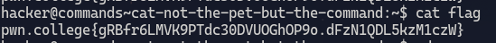

### Explanation

`cat` command reads the content of the file provided to it as an argument to the shell. In this case the argument is the relative path to the `flag` file.

***

&nbsp;

# catting absolute paths
1. **Objective**: Read the contents of the file `flag`.
2. **Solution**: Use the `cat` command and provide the absolute path for `flag` file as an argument to it.

&nbsp;

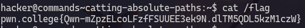

### Explanation

`cat` command reads the content of the file provided to it as an argument to the shell. In this case the argument is the absolute path to the `flag` file.

***

&nbsp;

# grepping for a needle in haystack
1. **Objective**: Read a specific line from the file `data.txt`
2. **Solution**: use `grep` command.

&nbsp;

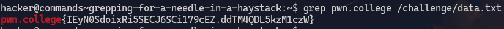

### Explanation

`grep` command can be used to search for a line containing specified set of strings. In this case the `data.txt` file has a lot of lines which can be quite difficult to skim through to find the flag if only the `cat` command is used to read it. Instead `grep` can be used to find a line containing "pwn.college" in the text file.

***

&nbsp;

# listing files
1. **Objective**: Find the modified `/challenge/run` file.
2. **Solution**: use `ls` to list all the files.

&nbsp;

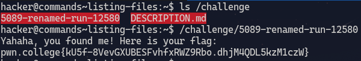

### Explanation

`ls` is used to list all the files inside the `/challenge` directory. Then the renamed run file is executed to get the flag. 

***

&nbsp;

# touching files
1. **Objective**: Create files in the `/tmp` directory
2. **Solution**: use `touch` command

&nbsp;

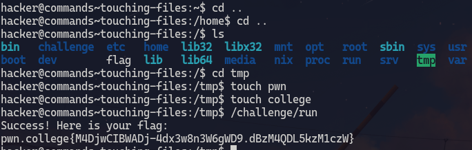

### Explanation

Move into the the `/tmp` directory inside the root directory. Use the command `touch` and provide the name of the file as an argument to it. This creates the file. Then execute `/challenge/run` to get the flag

***

&nbsp;

# removing files
1. **Objective**: Delete a file in `/home` directory
2. **Solution**: use `rm` command

&nbsp;

### Explanation
provide the name of the file i.e `delete_me` to the `rm` command as an argument. This deletes the file. Then execute `/challenge/check` to get the flag.

***

&nbsp;

# hidden files
1. **Objective**: Find the hidden file in the `/` directory.
2. **Solution**: use `ls` with `-a` flag.

&nbsp;

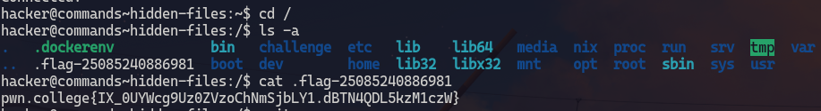

### Explanation
Move into the root directory. Then use `ls -a` to list all the files including the hidden ones (`ls`only lists the non hidden files). Then use `cat` to read that file.

***

&nbsp;

# An epic file system quest
1. **Objective**: Find the flag
2. **Solution**: Use `cd` `ls` `cat` commands

&nbsp; 

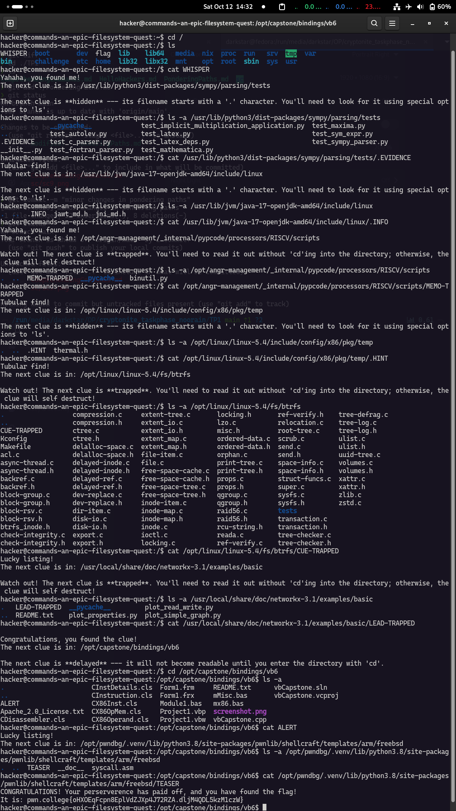

***

&nbsp;

# making directories
1. **Objective**: Create directories
2. **Solution**: Use `mkdir` command

&nbsp;

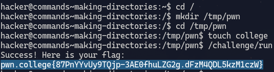

### Explanation

`cd` into the root directory. Then use `mkdir /tmp/pwn`, this command creates a `tmp` directory and then creates a `pwn` directory inside the `tmp` directory. Use `touch college` to create a file. Then run `/challenge/run`.

*** 

&nbsp;

# finding files
1. **Objective**: Find file containing the flag
2. **Solution**: use `find` command

&nbsp;

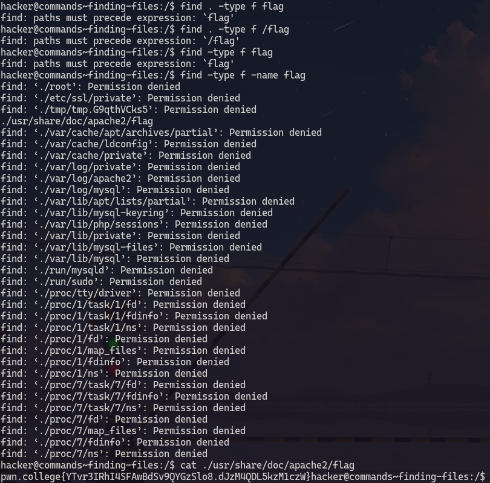

`find` can be used to find both files and directories. We can use `-name` flag to specifiy the name of the file/directory and `-type` flag to specify if we want to find a file or a directory.
We can use `man find` to checkout the man page of `find`
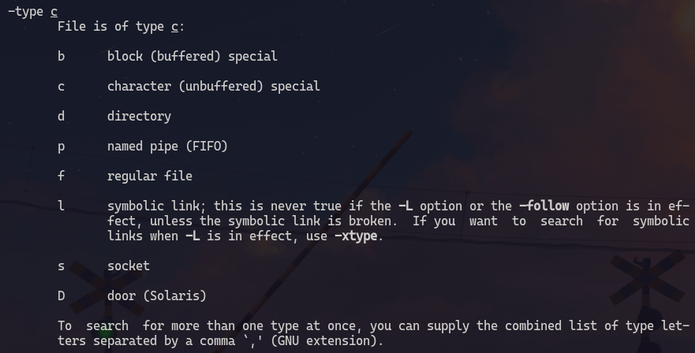\
If we use `-type f` flag then `find` will only look for files.\
The output of `find -type f -name flag` shows that there is only one file nammed `find` which is accesible. Then we can just use `cat` to read the contents of that file.

***

&nbsp;

# linking files
1. **Objective**: Create a symbolic link to the `/flag` file
2. **Solution**: use `ln` command

&nbsp;

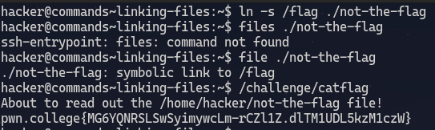

### Explanation
`ln -s` creates a soft link. The first argument is the file we want to create a symbolic link to and the second argument is the file that has the symbolic link to the given file.\
We can check the symbolic link by using the `file` command which finds out the type of the file.

