# Learning from documentation
1. **Objective**: Use the correct the argument to get the flag
2. **Solution**: Read the man page

&nbsp;

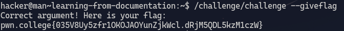

### Explanation
The man page for `/challenge/challenge` says\
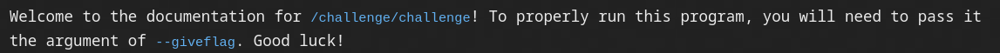 \
So we provide the correct argument i.e `--giveflag` and that will give use the flag.

***

&nbsp;

# Learning Complex usage
1. **Objective**: Use the correct argumment and pass an argument to that argument to get the flag.
2. **Solution**: Read the man page.\
The man page says\
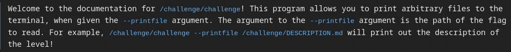

&nbsp;

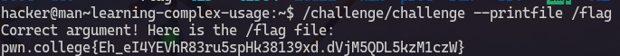

### Explanation
The man page says we need to provide the argument `--printfile` and then pass the path of the file we want to print to this argument as an argument. The flag is in `/flag` file so we write `--printfile /flag` and then give this as an argument to `/challenge/challenge --printfile /flag` which prints the right flag.

***

&nbsp;

# Reading manuals
1. **Objective**: Use the correct argument to get the flag
2. **Solution**: Read the man page by using the command `man`

&nbsp;

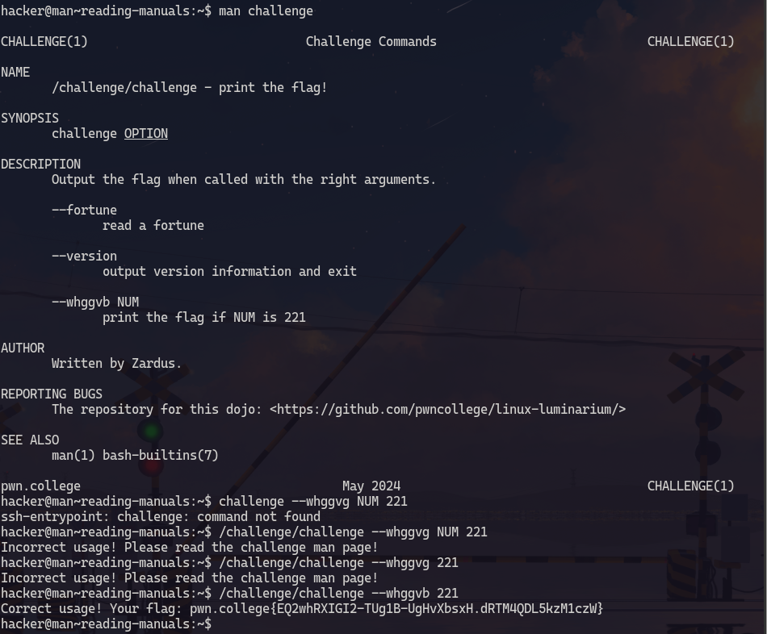

### Explanation

use `man challenge` to display the man page of `challeneg` program.\
As we can see in the man page `--whggvb NUM`'s description says that to print the flag `NUM` is `221`. So we provide the correct arguments to `/challenge/challenge --whggvb 221` which displays the right flag. 

***

&nbsp;

# Searching Manuals
1. **Objective**: Use the correct argument to get the flag
2. **Solution**: Read the man page by using the command `man` and search using `\` to find the right argument.

### Searching and finding the right argument

### Explanation
As the man page is very long we cannot skim through it and find out the right flag. Instead we use the search functionality to find the correct argument. \
For that we use `\` and provide the string we want to search for such as `\flag` or any string that might resemble what could be written in the description of the correct flag.\
Upon using `\flag` and the pressing `n` to move to the next occurence of flag we got to the right argument i.e `--zosu`.

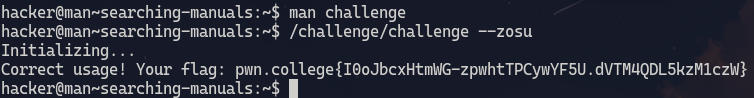 

Providing the correct argument which we found gave us the right flag.

***

&nbsp;

# Searching for manuals
1. **Objective**: Read the man page manpage and find out the right arguments to look for the right man page.
2. **Solution**: Use the command `man` to display the manpage of `man`.

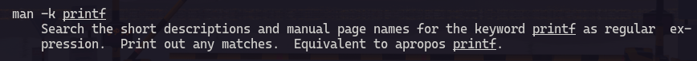
Upon reading the manpage of `man` we find out that `-k` argument can be used to search the `DESCRIPTION` and `NAME` seaction of the man page. So if we provide the correct argument to `-k` argument we can find out the right manpage.

`man -k challenge` gives the following output

The name of `challenge` program's man page is `boojiodkzc` (`(1)` means it is an executable) 

Next we display the correct man page using `man boojiodkzc`

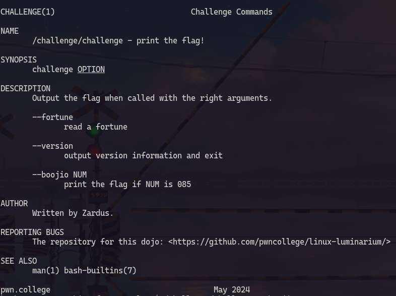

The correct argument is `--boojio 085` which gives us the correct flag

***

&nbsp;

# Helpful programs
1. **Objective**: Use an argument to get the usage of a program
2. **Solution**: Use the `--help` or `-h` argument to get the usage.

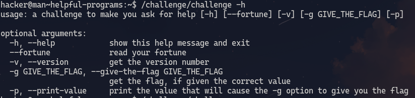

The `-g` argument gives out the correct flag if it is provided with the correct value.\
The correct value is obtained by `-p` argument.

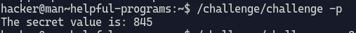

Then we provide this 'secret value' to the `-g` argument which will give us the correct flag

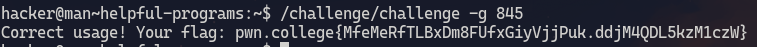

***

&nbsp;

# Help for builtins
1. **Objective**: Find the right argument to the flag
2. **Solution**: Use `help` to get the manpage.

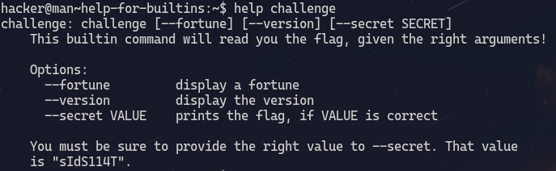

We got the right argument by reading the output.\

Next we provide the correct argument to `challenge`.\
We dont have to use the absolute path as `challenge` is a shell builtin.

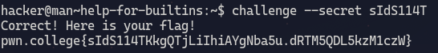
