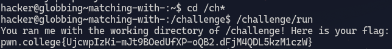
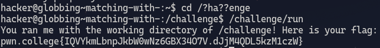
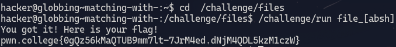
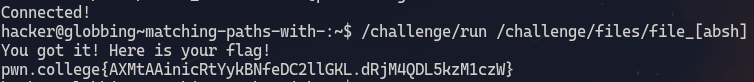
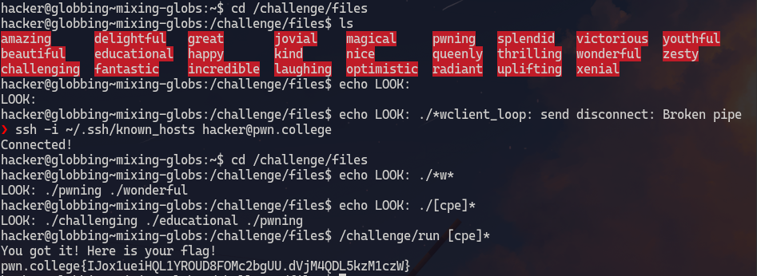
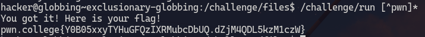

# Matching with *
1. **Objective**: Use globbing to change to the right directory
2. **Solution**: use `*`

&nbsp;

### Explanation
We cannot use `cd /challenge` as we can only provide an argument with 4 characters or less so we use a glob to solve this problem.\
`cd /ch*` will change directory to the directory whose name starts with `ch` and in the root directory, only `challenge` directory's name starts with ch.

***

&nbsp;

# Matching with ?
1. **Objective**: Use globbing to change to the right directory
2. **Solution**: use `?`

&nbsp;

### Explanation
The `?` glob is used to replace only single character.\
The above entered command will look for directories and files that has h,a,e,n,,g,e in their name in same order and then look for names that has characters at the same index as that of `?`. The `?` can be replaced by any character.

***

&nbsp;

# Matching with []
1. **Objective**: pass an argument to `/challenge/run` that globs multiple files by replacing only specified character.
2. **Solution**: use `[]`

&nbsp;

### Explanation

The `[]` is the almost the same as `?`. The only difference is that we can pass a bunch of characters to it `[abcd...]` and it will only glob those files that has those characters

***

&nbsp;

# Matching paths with []
1. **Objective**: pass an argument to `/challenge/run` which is a path that globs into multiple paths.
2. **Solution**: use `[]` with path

&nbsp;

***

&nbsp;

# Mixing globs
1. **Objective**: Mix glob to find files
2. **Solution**: use `[]` and `*`

***

&nbsp;

# Exclusionary globbing
1. **Objective**: Glob files that does not start with a specific set of characters
2. **Solution**: use `!` or `^`

### Explanation
The `^` character excludes specifies that all the characters after this character must be excluded. So `[^pwn]*` excludes files that has p,w,n at the start of their names.

