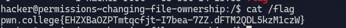

# Changing file ownership
1. **Objective**: Change owner of flag file.
2. **Solution**: Use `chown`

&nbsp;

### Explanation
We can change ownership by using `chown` 

Before `chown` the owner is root therefore we cannot read that file

After `chown hacker /flag` the ownership is now changed

***

&nbsp;

# Groups and files
1. **Objective**: Change group ownership of flag file.
2. **Solution**: use `chgrp` 

&nbsp;

### Explanation
The group of `/flag` is root \

Upon using `chgrp hacker /flag` the group of `/flag` is changed \

Now we can read flag file \

***

&nbsp;

# Fun with group names
1. **Objective**: Find the right group of user.
2. **Solution**: Use `id`

&nbsp;

### Explanation
Finding the group of user \

Changing the group of `/flag` file accordingly and then reading the file \

***

&nbsp;

# Changing permissions
1. **Objective**: Read `/flag` without changing ownership
2. **Solution**: Change permission of that file using `chmod`

&nbsp;

### Explanation
`r--` means that owner can read the file ie root can read the file \
`------` means that users belonging to root group as well as other users can do nothing with this file

`chmod o+r /flag` changes the permission for other users so that they can read it. In this case other user is `hacker`   

***

&nbsp;

# Executable files
1. **Objective**: Make a file executable for `hacker`
2. **Soltion**: Change permission for `hacker` 

&nbsp;

### Explanation
As the owner of this file is `hacker` we only need to change permission for owner. \
`chmod u+x /challenge/run` adds a permission so that owner can execute the file.

***

&nbsp;

# Permission tweaking practice
1. **Objective**: Change the permission of file as per instruction given

&nbsp;

### Explanation
`chmod u+(permssion) some_file` - adds permission for owner \
`chmod g+(permssion) some_file` - adds permission for group \
`chmod o+(permssion) some_file` - adds permission for other user \

`chmod u-(permssion) some_file` - removes permission for owner \
`chmod g-(permssion) some_file` - removes permission for group \
`chmod o-(permssion) some_file` - removes permission for other user \

***

&nbsp;

# Permission setting practice
1. **Objective**: Set permission
2. **Solution**: Use `chmod u=`

&nbsp;

### Explanation
`chmod u=(permission) some_file` - sets the permssion to the specified permission \
We can also chain multiple permission like so `chmod u=rw,g=x,o-r some_file`

***

&nbsp;

# The SUID bit
1. **Objective**: Change the permission so that non root user can can root permission 
2. **Solution**: Put `s` in place of `x`

&nbsp;

