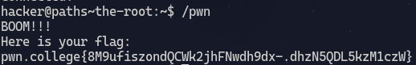
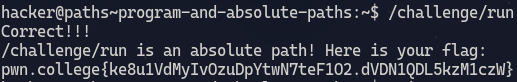
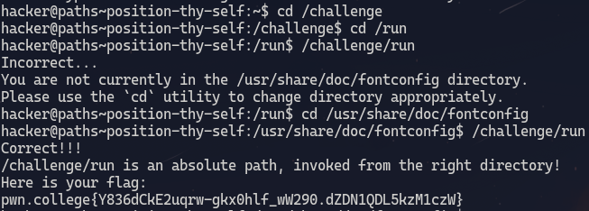
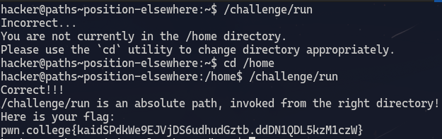
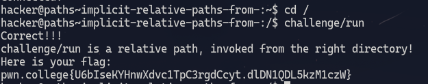
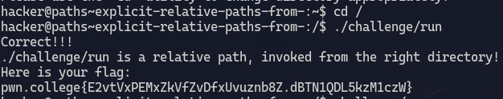
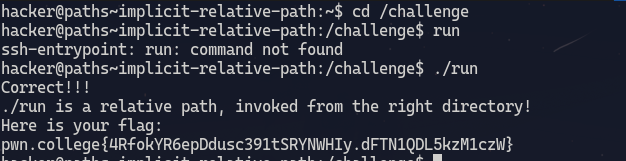
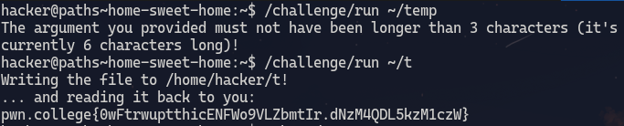

# The root
1. **Objective**: Invoke the program pwn located in root directory
2. **Solution**: use the absolute path `/pwn`

&nbsp;

#### Explanation ####
The file systems starts from the root directory which can be accesed using `/`.
    As the `pwn` program is located in the root directory `/` can be used to access it.
    So `/pwn` is the absolute path of `pwn` file.
    The path of an executable is simply provided to the command line to execute it.

***

# Program and absolute paths
1. **Objective**: Invoke the program located in challenge directory in the root directory
2. **Solution**: use the absolute path `/challenge/run`

&nbsp;

#### Explanation ####
 `/` is the path for root directory.
    `/challenge` is the path for challenge directory in the root directory.
    `/challenge/run` is the absolute path for `run` program inside challenge directory.
    Providing the absolute path for `run` program to the command line executes it.

***

# Position thy self
1. **Objective**: Invoke the `run` program in the `/challenge` directory after changing the working directory.
2. **Solution**: use the `cd` to change the working directory.

&nbsp;

#### Explanation ###
`cd /challenge` changes working directory to `/challenge`. The working directory is displayed right before the `$` in the shell.
Executing `cd /run` in the `/challenge` directory again changes workinf directory to `/challenge/run`.Upon invoking the `run` program in this directory it gives the instruction to change the working directory. `cd /usr/share/doc/fontconfig` changes the working directory accordingly. Again invoking the `run` program from the current working directory by providing the absolute path i.e `/challenge/run` to the command line invokes the program and gives out the correct flag.

***

# Position elsewhere
1. **Objective**: Invoke the `run` program in the `/challenge` directory after changing the working directory.
2. **Solution**: use the `cd` to change the working directory.

&nbsp;

#### Explanation ####
Invoking the `run` program from current working directory i.e `~` gives the next instruction to change the working directory to `/home`. After `cd`'ing into the `/home` directory and providing the absolute path for `run` program i.e `/challenge/run` gives the correct flag.

***

# implicit relative path, from /
1. **Objective**: Invoke the `run` program using relative path.
2. **Solution**: use `cd` to change `cwd` to where run is.

&nbsp;

#### Explanation ####
A relative path is a path that does not start with `/`. If a path does not start with `/` then the path is interpreted relative to the `cwd` (current working directory).
In this solution the `cwd` is changed to `/` first and then `challenge/run` which is a relative path is provided to the command line. `challenge/run` is a relative path as this allows searching for the correct file only inside the `/` directory. 

***

# explicit relative paths, from / 
1. **Objective**: Invoke the `run` program using relative path.
2. **Solution**: use `cd` to change `cwd` to where run is then use `.` in the relative path.

#### Explanation ####
The `.` refers to the same working directory.

***

# implicit relative path
1. **Objective**: Invoke the `run` program using relative path.
2. **Solution**: use `cd` to change `cwd` to where run is then use `.` in the relative path.

#### Explanation ####
When inside the `/challenge` diirectly, directly entering `run` would yield such error because linux explicity avoids looking in the `cwd` when we provide a naked path. if Linux searched the current directory for programs every time naked path is entered, it could accidentally execute programs in the current directory that happened to have the same names as core system utilities
The way to solve this issue is to explicitly tell linux that we want to execute a program in the current directly by using `.`.

***

# home sweet home
1. **Objective**: Provide the `run` program with an argument which specifies where we want the flag to be copied to to. 

#### Explanation ####
`~` expands to `/home/hacker`. This is the default directory in which the shell opens to. 
`~/temp` expands to `home/hacker/temp` which is the argument given to the `run` program. Next `run` is executed and it copies the flag to the `temp` file in `~` directory and displays it on command line.
