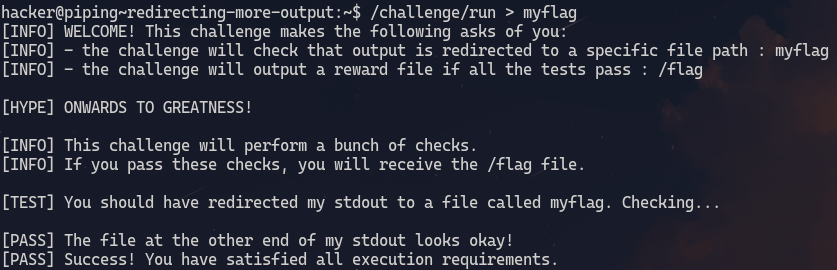
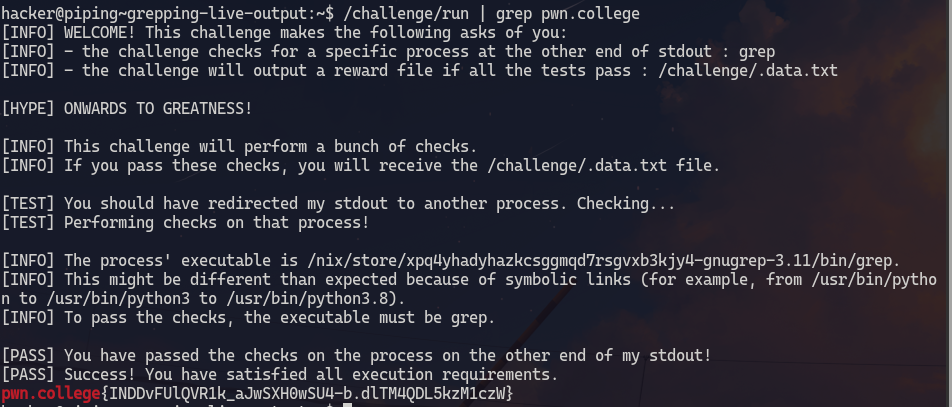

# Redirecting output
1. **Objective**: Redirect the output of `echo` as an input to another.
2. **Solution**: use `>` character

&nbsp;

### Explanation
The `>` character creates a new file redirects the output of `echo` command to directly right to a file called `COLLEGE`

***

&nbsp;

# Redirecting more output
1. **Objective**: Redirect the output of `run` command as an input to another.
2. **Solution**: use `>` character.

&nbsp;

### Explanation

The `>` character creates a new file redirects the output of `/challenge/run` command to directly right to a file called `myflag`

Reading the output of `/challenge/run` by using `cat` command on `myflag` file.

***

&nbsp;

# Appending output

1. **Objective**: Append the output to an already created file without deleting its contents.
2. **Solution**: use `>>` 

&nbsp;

### Explanation

Upon using `/challenge/run >> the-flag` the output of second `stdout` in the `run` program appended output of first `stdout` in `the-flag`. 

Upon using `/challenge/run >> the-flag` the output of second `stdout` in the `run` program overwrites the output of first `stdout` in `the-flag`. 

***

&nbsp;

# Redirecting errors
1. **Objective**: Redirect different communication channels to different files
2. **Solution**: use `(x)>` where `x` is the numerical file descriptior.

&nbsp;

### Explanation
`>` or `1>` redirects standard output and `2>` redirects standard errors. \
In this case standard output is redirected to `myflag` and standard error is redirected to `2>`.

***

&nbsp;

# Redirecting inputs
1. **Objective**: Redirect input to `run` program
2. **Solution**: Use `<`

&nbsp;

### Explanation

First we need to write the input into a file. So we use `>` to write COLLEGE into `PWN` file.
And then use `<` to redirect COLLEGE from `PWN` as an input to `run` program

***

&nbsp;

# Grepping stored results
1. **Objective**: redirect output to a file and find the flag from that file
2. **Solution**: use `>` and `grep`

&nbsp;

### Explanation
Redirect the output of `run` to `/tmp/data.txt` then use `grep` command on `/tmp/data.txt` to grab the line that contains the string "pwn.college".

***

&nbsp;

# Grepping live output
1. **Objective**: Use `grep` on live output.
2. **Solution**: use pipe operator `|` 

&nbsp;

### Explanation

The standard output of `/challeneg/run` will be connected to standard input of `grep`.
The pipe operator connects output of command on the left to input of command on the right.

***

&nbsp;

# Grepping errors
1. **Objective**: Grep live errors using pipe operator.
2. **Solution**: Use `>&`

&nbsp;

### Explanation

Since the pipe operator only connects stdout to stdin we need to redirect stderr to stdout inorder for `|` to correctly supply the `grep` command with correct input.
For that we use `2>&1`. `2>` redirects stderr from the `/challenge/run` command, and `&1` redirects stderr to stdout, then `|` connects stdout to `grep`'s stdin.

***

&nbsp;

# Duplicating piped data with tee
1. **Objective**: Intercepting the data being transfered through pipe.
2. **Solution**: Use `tee` command

&nbsp;

### Explanation
The stdout of `/challenge/run` is duplicated and put written into the file `code` and then it is moved ahead to stdin of `/challenge/college`. \
Upon reading the contents of code we see that `/challenge/pwn` requires a specific argument so that it can give the correct output to `/challenge/college` so that it can display the flag. 
We can intercept the correct output of `/challenge/pwn` and see what the correct input to `/challenge/college` is. 

***

&nbsp;

# Writting to multiple programs
1. **Objective**: Write to stdin of multiple programs
2. **Solution**: use `tee` with `>()` 

&nbsp;

### Explanation

`/challenge/planet` is run and its stdin is hooked to a pipe. Next `>(/challenge/the)` is executed and its stdin is hooked to an named pipe. Next `tee` command is executed and its first argument is replaced with the named pipe. Next `/challenge/hack` is executed.\
`tee` read stdout of `/challenge/hack` then wrote it to the named pipe and then stdout. \
`/challenge/the` reads its input from the named pipe. \
`/challenge/planet` reads its input from stdout where `tee` wrote earlier.

***

&nbsp;

# Split-piping stderr and stdout
1. **Objective**: Split stderr and stdout for two proceses

&nbsp;

