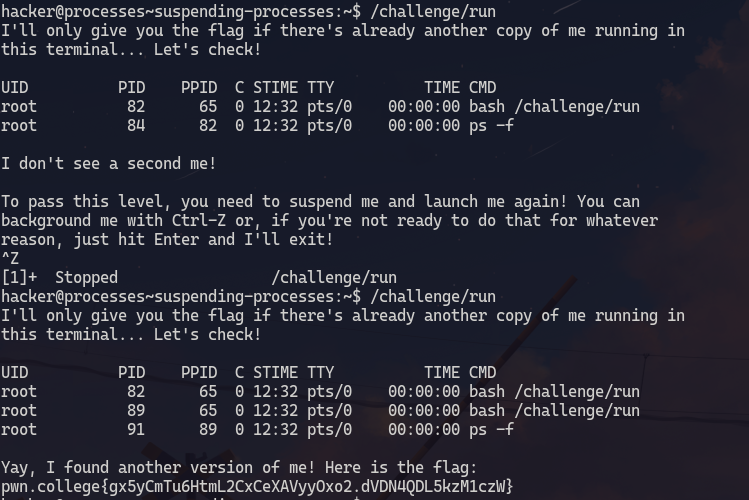

# Listing Processes
1. **Objective**: List all processes and identify the right one.
2. **Solution**: Use `ps` 

&nbsp;

### Explanation
The `ps` command lists all the processes. The `ef` argument can be used to list "every process" and "full format" 

***

&nbsp;

# Killing processes
1. **Objective**: terminate other running proccess
2. **Solution**: Use `kill`

&nbsp;

### Explanation
We used the `ps -ef` command to list all the processes to find the PID(process id) of the right proccess. Then we used `kill` and provided the PID as an argument to it to terminate that process.

***

&nbsp;

# Interrupting processes
1. **Objective**: Interrupt a process running in the terminal
2. **Solution**: use `ctrl-c`

### Explanation
`ctrl-c` interrupted `/challenge/run`.

***

&nbsp;

# Suspending process
1. **Objective**: Suspend a process and not terminate it to get the terminal back
2. **Solution**: Use `ctrl-z`

&nbsp;

### Explanation
Upon using `ctrl-z` while `/challenge/run` was running, it suspended it (not terminate).
Now another `/challenge/run` is executed. Now both `/challenge/run` is running but one is suspended. This can be confirmed by looking at the process list. There are two `/challenge/run` in the process list.

***

&nbsp;

# Resuming process
1. **Objective**: resume a suspended process
2. **Solution**: use `fg` command

&nbsp;

### Explanation
The `fg` command is used to resume a suspended process. If there is only one suspended process then `fg` resumes that process. If there are more than one then we can provide that process PID to `fg` to resume it.

***

&nbsp;

# Backgrounding process
1. **Objective**: resume a process in background
2. **Solution**: use `bg` command

### Explanation
The `bg` command can be used to run a process in background. This allows the user to use the terminal while a process is still running. We can view if a process is sleeping or running background or foreground by using `ps -o stat`. \
If the process has `+` is `stat` column then it is in fg. \
`R` means it is actively running. \
`T` means it is suspended. \
`S` means it is sleeping. \

***

&nbsp;

# Foregrounding process
1. **Objective**: Foreground a background process
2. **Solution**: use `fg`

&nbsp;

We can use `fg` to bring a process from background to foreground.

***

&nbsp;

# Starting background process
1. **Objective**: Start a process in background
2. **Solution**: append the process with `&`

&nbsp;

***

&nbsp;

# Process exit codes
1. **Objective**: View a process' exit code and use it as an argument for another process
2. **Solution**: The exit code is stored in `?` variable

&nbsp;

### Explanation
`/challenge/get-code`'s exit code is stored in `?` variable which can be viewed by `echo $?`.
