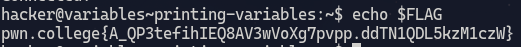
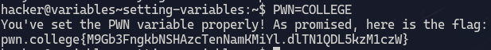
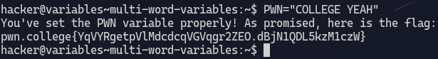
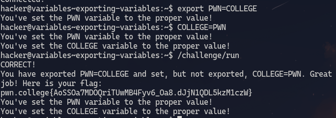
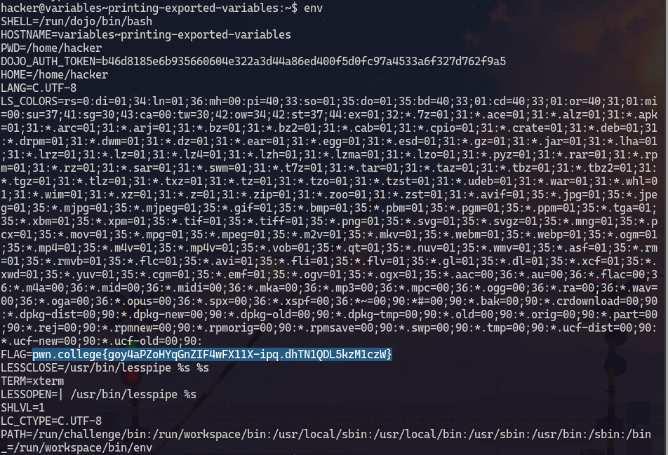
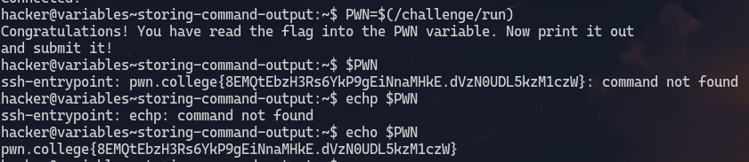
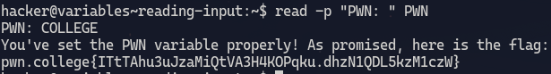
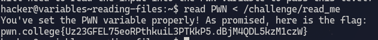

# Printing variables 
1. **Objective**: Print out a shell variable
2. **Solution**: Use `$`

&nbsp;

***

&nbsp;

# Setting variables
1. **Objective**: Set a shell variable
2. **Solution**: Use `=`

&nbsp;

***

&nbsp;

# Multi word variables
1. **Objective**: Set a multi word value to a shell variable
2. **Solution**: enclose the word within `""`

&nbsp;

***

&nbsp;

# Exporting variables
1. **Objective**: Export variables so that they can be passed onto child processes
2. **Solution**: Use `export` keyword

&nbsp;

### Explanation
`export` can be used to pass variable into child processes. If we dont use export then that variable will be local only to that process. Upon using `export` then that variable is visible to all other child processes.
        
        hacker@dojo:~$ VAR=1337
        hacker@dojo:~$ echo "VAR is: $VAR"
        VAR is: 1337
        hacker@dojo:~$ sh
        $ echo "VAR is: $VAR"
        VAR is: 

&nbsp;

        hacker@dojo:~$ export VAR=1337
        hacker@dojo:~$ sh
        $ echo "VAR is: $VAR"
        VAR is: 1337

***

&nbsp;

# Printing exported variables 
1. **Objective**: Print exported variables
2. **Solution**: Use `env` command 

&nbsp;

***

&nbsp;

# Storing command output
1. **Objective**: Store the output of a command into a variable
2. **Solution**: use `$()` 

&nbsp;

### Explanation
The command inside `$()` is executed in a subshell environment and then the standard output of this replaces the command itself in the parent shell.

***

&nbsp;

# Reading input
1. **Objective**: Read input from command line
2. **Solution**: use `read` builtin

&nbsp;

### Explanation 
The `read` commands allows the user to input a value into the stdin channel and then it reads from stdin and puts that value into the variable specified as argument.
`-p` argument can be used to display. 

***

&nbsp;

# Reading files
1. **Objective**: Read from a file and write the output to a shell variable
2. **Solution**: pair `<` and `read`.  

&nbsp;

### Explanation
The ouput of `/challenge/read_me` is redirected to stdin which is then read by `read` and put into the `PWN` variable.
