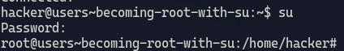
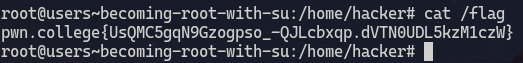
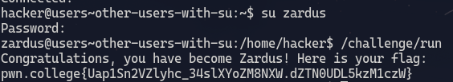
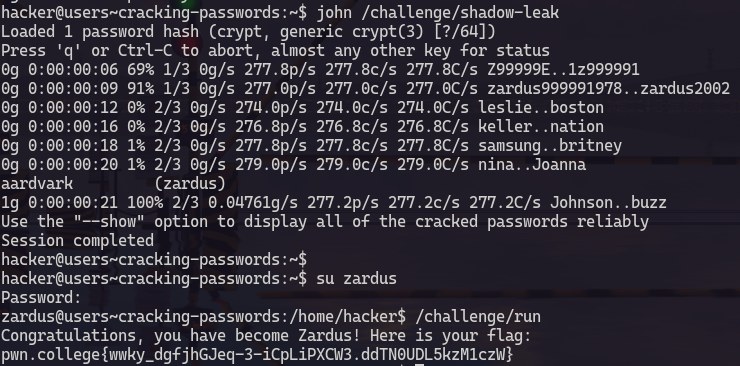
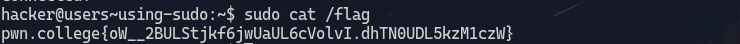

# Becoming root with su
1. **Objective**: Become the root user and then read the flag
2. **Solution**: Use `su` builtin

&nbsp;

### Explanation
The `su` command is used to start a root shell if it is run as root. \
Since `su` command already has SUID bit set. We just have to provide a password to it so that it can start a root shell. \
A root shell has all the root privelages and for this challenge we have to be root user to get the flag. 

***

&nbsp;

# Other users with su
1. **Objective**: Change user
2. **Solution**: Use `su` to change user

### Explanation

We can also use `su` to change users after authenticating with root's password.

***

&nbsp;

# Cracking passwords
1. **Objective**: Crack zardus's password and execute `run` in zardus's shell
2. **Solution**: Use `john` a password cracking tool

&nbsp;

### Explanation
All passwords are stores in a file `/etc/shadow`.
When a password in entered into `su` it hashes it an compares with the stored password in the `shadow` file. \
If somehow the `shadow` file got leaked, we can crack the hash and get the password. \
In this challenge the data leaked from `shadow` file is stores in `/challenge/shadow-leak` \
We can use `john` a brute force password cracker to decrypt the hash stores in the leaked file.

***

&nbsp;

# Using sudo
1. **Objective**: Execute a command as root
2. **Solution**: Use `sudo`

&nbsp;

### Explanation
`sudo` can be used to execute a single command as root unlike `su` which starts a root shell granting full root permission. 
