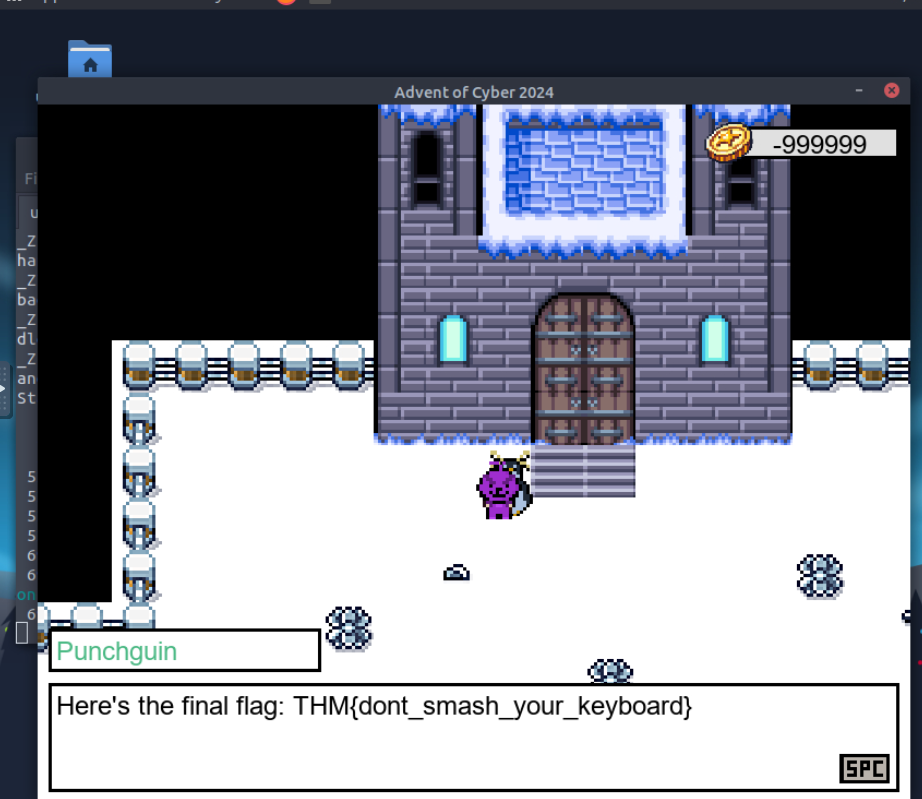

frida is an instrumentation toolkit that allows developers to instrument and manipulate running application.
javascript or python can be used to write instrumentation script. 
When an application is run with frida 
It generates handler function that attaches to the process. 
Each handler will have two function called onLeave and onEnter. 
onLeave will be used to analyze the return value and onEnter to analyze the function parameters.

In this challenge we will use frida to read and manipulate function parameters and return values using javascript.

`frida-trace ./anElfFile -i '*'`
This command will generate handler functions for every function the program calls.

Level 1
The npc asks for an otp. We can use frida to read parameters to the functions that checks if
the entered otp is correct. One of parameters could be the otp. 

Level 2

Level 3

