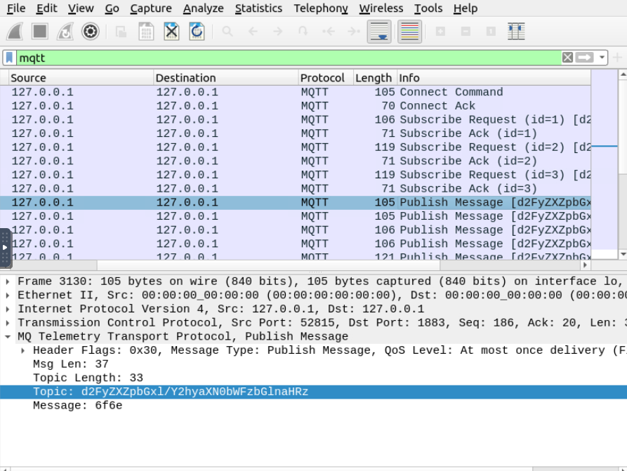
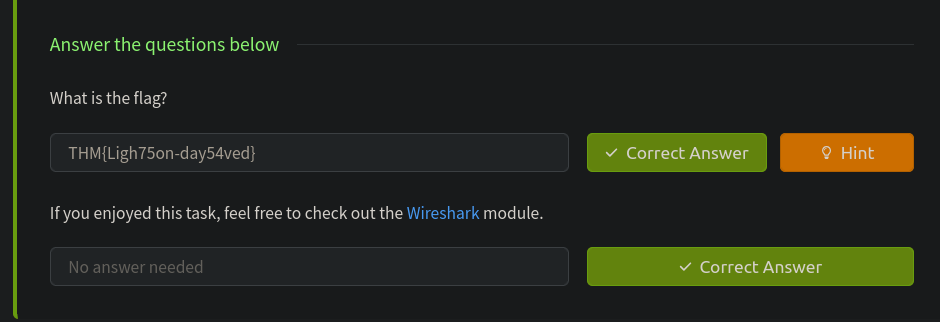

# CommunicationProtocol

[MQTT](https://mqtt.org/) is a standard messaging protocol for IOT devices. It uses the Publish/Subscribe Model where devices (or clients) can either publish messages to a topic or subscribe to a topic to receive messages. This decouples the producer and consumer of data, allowing for flexible communication. 

MQTT operates over TCP/IP and uses a central server known as a broker that facilitates the communication between clients. Popular MQTT brokers include Mosquitto and HiveMQ.

#### Communication over MQTT 

`Client` Any device or application that uses MQTT to send or receive messages.
`Broker` A server that handles message distribution between clients.
`Topics` Channels where messages are published. Clients subscribe to topics to receive messages.
`QoS (Quality of Service)` Defines the guarantee level for message delivery. MQTT supports three levels:
0: At most once (best effort).
1: At least once (message is delivered but may duplicate).
2: Exactly once (ensures no duplication).

- Step 1: Connecting to the Broker
	- A client initiates a connection to the broker using a TCP/IP connection.
    - The client sends a CONNECT message with its credentials (if required) and a unique client ID.
	- The broker responds with a CONNACK message to confirm the connection
	
- Step 2: Subscribing to topics
	- A client interested in receiving messages from a specific topic sends a SUBSCRIBE message to the broker.
	- The broker registers this subscription and sends a SUBACK message to acknowledge the request.

- Step 3: Publishing message
	- Another client (a publisher) sends a PUBLISH message to the broker, specifying the topic and the message payload (the actual content of the message).
	- The broker receives this message and forwards it to all clients subscribed to that topic.

In this challenge we will be using Mosquito broker
Mosquitto is an open-source MQTT broker that facilitates communication between MQTT clients. 

We have to turn on the light bulb using mosquito to get the flag

`mosquitto_pub -h localhost -t "some_topic" -m "message"`

The topic is d2FyZXZpbGxl/Y2hyaXN0bWFzbGlnaHRz
Message is on

