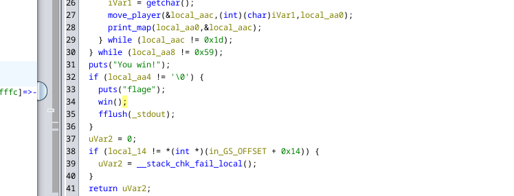
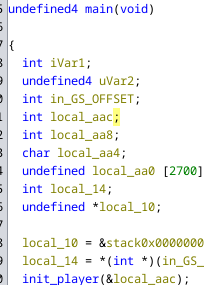
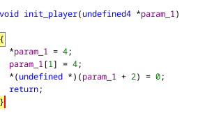
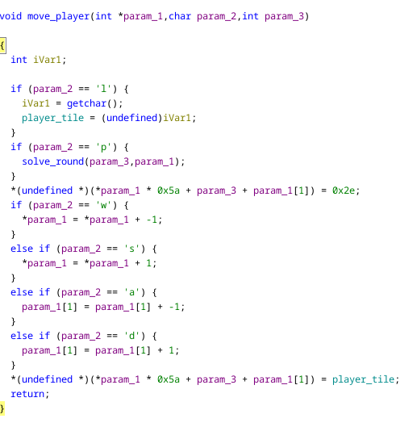

### Problem 

Retreive the flag 


I used ghidra to decompile the game 


So in the code there is a `win()` function which prints the flag. \ 
We need to figure out how to call this function.




In the main function we can see that `win()` is called when `local_aa4 != null`. \ 
So our goal is to write a non null value at `local_aa4` and win the game.



Upon analysing the main function we can see that

```c
  int local_aac;
  int local_aa8;
  char local_aa4;
```

in the main stack these variables are declared on after the other. Now what are these variables

In the main function, `init_player()` takes the address of `local_aac`. \



In the `init_player()` function, aac and aa8 are initialised to 4 which means these variables hold the position of the player. 



Now in the `move_player()` function we can see that the game can take w, a, s, d, l, p as input. \
l can be used to change the character token or player_tile and p is used to solve_round which 

The problem in this function is that it does not check for negative player movement. \
Which means we can easily move out of the map write anywhere on the stack which means if we can find where local_aa4 is intialised on the stack we can change it's value. 

At begining of the main function we can see that the map is initialised right after `local_aa4` on the stack which means this variable is located -4 bytes from where map is intialised. 

```c
  if (param_2 == 'w') {
    *param_1 = *param_1 + -1;
  }
  else if (param_2 == 's') {
    *param_1 = *param_1 + 1;
  }
  else if (param_2 == 'a') {
    param_1[1] = param_1[1] + -1;
  }
  else if (param_2 == 'd') {
    param_1[1] = param_1[1] + 1;
  }
```

From the move player function which takes `local_aac` and user input as argument we can see that `w and s` command changes `*param_1` and `a and d` changes `param_1[1]` 

Again looking in the move player function we can see how character is moved in game 

```c
*(undefined *)(*param_1 * 0x5a + param_3 + param_1[1]) = player_tile;
```
If the current position of the player is (4,5) then its position is calculated by `4*90 + 5` \
Now suppose character move 5 spaces to the right `d5` \
Its postion will be calculated as `4*90 + 5 + 5` 

So if we want to move to `0*90 - 4` we can initialise `param_1` as 0 and `param_1[1]` as -4 when position of the character is (0,0)


So finally to solve this challenge move the character to (0,0) then enter `aaaa` and then `p` to end the game


`picoCTF{gamer_m0d3_enabled_2682e995}`
