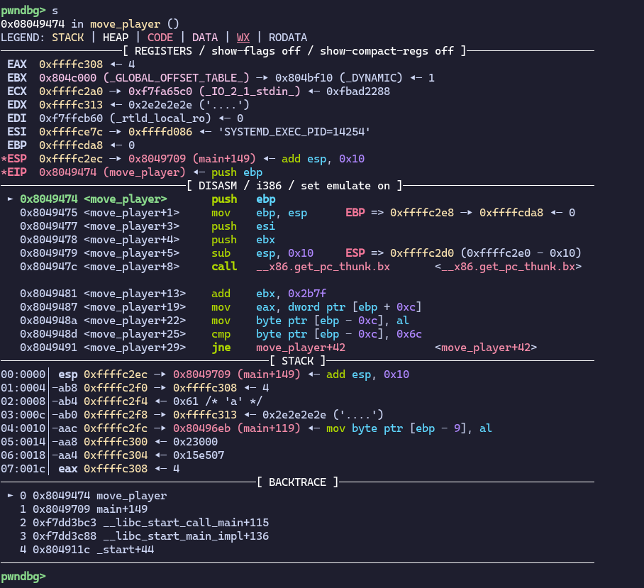

### Problem 

Retreive the flag


In this problem the `win` function is not called from within the game but it is present in game's memory. 

By decompiling the game we can see that the `win` function is written just after `main` function.

So in order to call the `win` function we have to change the value in at the address that holds the return address of the main function. 

So we just have to move the character in the game and reach the point in stack that holds the return address and change it to from where `win` function is written. So that when main function returns the program counter will point to the `win` function and start executing it.


LEA src, dest - Copies the value of src itself to destination \
EBP is the base pointer register \
ESP - The address of the current top of the stack is stored in this. In x86, stack grows from higher address to lower address. So in x86 the stack grows downward. \
CALL- This instruction is used to call a function. When this instruction executed it performs an implicit PUSH instruction and pushes the return address on top of the stack.\
RET - This instruction is used to return from a function. By the time a function ends all its parameters will be cleared and only the return address will be at the top of the stack. \
(For this challenge we have to change this return address to an address in the `win` function and to do that we have to find out where the return address is stored on the stack) \

#### How are local variables accessed in x86 \

```c
// https://medium.com/@sruthk/cracking-assembly-accessing-local-variables-in-x86-vs-x64-eb018ce1ef2a
void calculate(int num1, int num2)
{
 int sum = 0;
 int difference = 0;

 sum = num1 + num2;
```
First the stack pointer is moved to make space for local variables. In this case we have two 4 bytes variable so ESP is subtracted with 8 \
The local variables are accesed using EBP register which points at the base of the stack. \
sum is at EBP - 8 and difference is at EBP - 4 \
Paramters are stored at a positive offset from EBP \
num1 is at EBP + 8 and num 2 is at EBP + 0CH \ 
There is a gap of 4 bytes between num1 and where EBP is pointing because there is a return address in between. 

#### Function prologue

    In x86 assembly, Function Prolog typically does the following three steps:

    Pushes the current value of EBP to the stack
    Loads the current value of ESP to EBP
    Updates ESP to make space for the local variables of the function as well as the parameters passed through registers

    Step 1 — EBP is used to find out the parameters passed to each function as well as the return address for each function in the current call stack. Also, EBP points to the base of the function’s stack in x86. Due to these reasons, we need to store the EBP value for the caller function’s frame (Previous EBP) before modifying it in the new function.

    Step 2 — Once previous EBP is saved, the current value of ESP is copied to EBP. This will be the new stack base address for the new function that is called.

    Step 3 — Make space for the parameters passed through registers as well as local parameters of the called function by updating ESP accordingly. Once this is done, the address range between the new EBP and new ESP would be the function’s stack frame where local variables of the function is stored.


#### Stack Frame


(https://medium.com/@sruthk/cracking-assembly-function-prolog-and-epilog-in-x86-cb3c3461bcd3)


After spending hours on this i was able to write the stack like in the picture. And got the distance of return address from map. But this is still wrong.

I tried using gdb to get the exact stack frame but i am still trying to figure out how to use gdb. 


Okay so finally i came accross this nice tool called pwndbg that makes using gdb not suck. 



In the stack ffffc313 is the map and ffffc2ec is the return address that points to the instruction right after call move_player

There differnce comes out to be 39 which 12 more than what i came up with by dry running. (I dont know why there is an extra 12 for now, I will update this part later when i figure it out)

So in order to jump to win method we need to change the value at map - 39 but we cannot directly go there because there are other stuff stored before it so we need to step one row up and then go 39 columns to the right and change the player token to p which will change the return address to a line in win method. So after the program finishes move_player the EIP register will have this address and the win function will start executing and we will get our flag. 


`picoCTF{gamer_jump1ng_4r0unD_d0bed747}`
