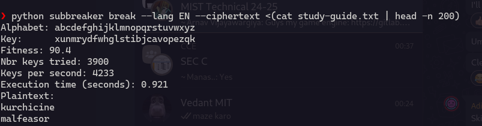
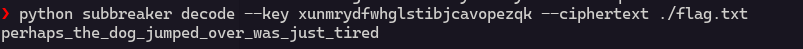

# Spelling-quiz

The `encrypted.py` script encrypted `flag.txt` and `study-guide.txt` using a substitution cipher. 
The key used is generated randomly.

We can use frequency analysis to decipher the key.
Luckily there is a tool called `subbreaker` which can do that. 

This tool analyzes the frequency of single letters or pairs of letters in the cipher text to create an initial guess about the character mapping.

Now based on the frequency analysis the program generates an initial guess for the mapping which is then further optimised. \

Subreaker uses optimization technique like `Hill climbing` to improve the initial key.

This optimisation technique relies on scores. \
The program tests small changes to the mapping and checks if they give more meaningful word. \
After each change the program evaluates the quality of the mapping based on how english-like the text is which done by using frequency analysis or common bigrams or trigrams.\

The key generated is `xunmrydfwhglstibjcavopezqk`

Now we can use this to decode `flag`

The flag is `picoCTF{perhaps_the_dog_jumped_over_was_just_tired}`

