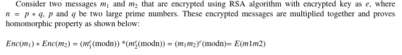
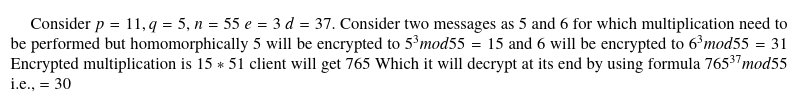

### Problem
Description
Oracles can be your best friend, they will decrypt anything, except the flag's ciphertext. How will you break it?

The oracle can decrypt any message except the flag. So our goal is to make oracle decrypt another cypher text and we should be able to retreive the flag from that decrypted text
Since we know that message is not padded. This means the encryption is malleable

Encryption : m^e mod n
Decryption : m^d mod n

Malleable means that if a cypher text c encrypts m. We can compute c' = c*2^e mod n \
Now we can give c' to oracle who will decrypt this and the decrypted text will we 2*m where m is equal to the original message \
Now we can divide the received message by 2 and convert it to string to get the message. 





source: (https://www.sciencedirect.com/science/article/pii/S1877050922020981/pdf?md5=12d5e413970e47277e864ad35a159aa1&pid=1-s2.0-S1877050922020981-main.pdf)

From the oracle 

    n: 141140180871616443724284469876959910505591517524537035886124354734443651155478149377633158020843072587539566062188788083689714847530908762075925180321660210486741825582624370267473082296104391709193786515815640625886753324821386350978754482422669483045983638161857582114861328988335784204158502901388110032661
    e: 65537
    ciphertext: 22634256377815713703025857649981459100999370132601827524583992232099483259851392411833755883426039649910307365582690909869832914419404438574596199606977825653173107419913767216073313463122601692417848374882716072312115196040263595378569938354353657739887779081420988427337233450330775792628509879615956885114


Now we change the cipher text so that oracle cannot detect it

```python
>>> n = 141140180871616443724284469876959910505591517524537035886124354734443651155478149377633158020843072587539566062188788083689714847530908762075925180321660210486741825582624370267473082296104391709193786515815640625886753324821386350978754482422669483045983638161857582114861328988335784204158502901388110032661
>>> e = 65537
>>> c = 22634256377815713703025857649981459100999370132601827524583992232099483259851392411833755883426039649910307365582690909869832914419404438574596199606977825653173107419913767216073313463122601692417848374882716072312115196040263595378569938354353657739887779081420988427337233450330775792628509879615956885114
>>> print(c*pow(2,e,n))
```
The output

    1851157873558162682208713671077766094720204305807483880826558569443123986545354653149104953497714082998308429507177086888169039424517901897790948267143328687454483059709179859708289778089252143310133386245281444154339357294836349602636074638127007751601944853877540655399037414135437361550465389541595018941973847542657034267944879806507975499330545886204703288807016465189190364424531107072972227016886759984802338906438184187666611112145797298076748236162934544303011571676368494849909997254463492655626566611877118894056782143948787398997253805781074285253058455538938492989468915902751936810313186141311684033300

The decrypted text received from oracle

    580550060391700078946913236734911770139931497702556153513487440893406629034802718534645538074938502890769138695361576199930

```python
>>> m = 580550060391700078946913236734911770139931497702556153513487440893406629034802718534645538074938502890769138695361576199930 // 2
```

```python
>>> import codecs
>>> h = hex(m)
>>> print(codecs.decode(h,'hex').decode('utf-8'))
>>> print(codecs.decode('7069636f4354467b6d347962335f54683073655f6d337335346733735f3472335f646966757272656e745f333237393031337d','hex').decode('utf-8'))
picoCTF{m4yb3_Th0se_m3s54g3s_4r3_difurrent_3279013}
```
