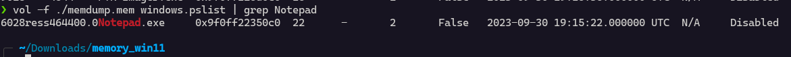
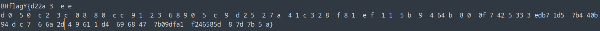

I used volatility to analyze this file

The PID of notepad is

Next I used the `windows.memmap.Memmap` plugin of volatility to dump the memory map

`vol -f ./memdump.mem -o ./ windows.memmap.Memmap --pid 6028 --dump`

Then I searched for strings in this file and used grep to find lines that has `BH` in it

It seems the flag format is `BHflagY{}`

