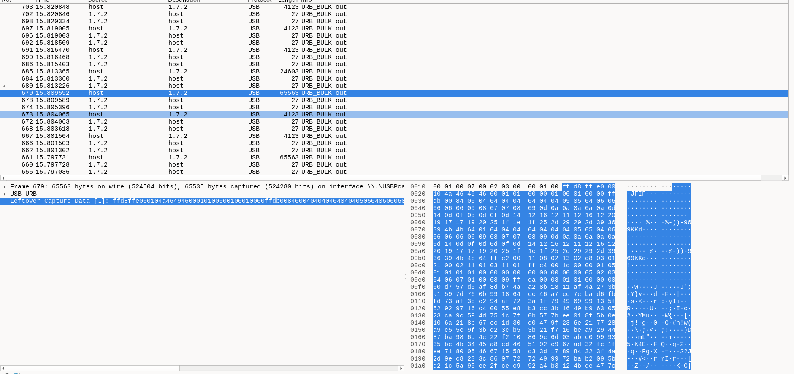
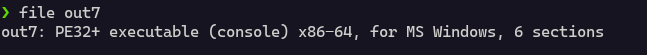
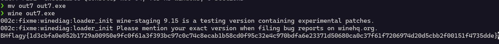

There are many `USB_BULK_OUT` packets captured and most of it is `JFIF` ie jpg images

I sorted this with respect to size and extracted file whose size was large and among those jpg files there was an executable

