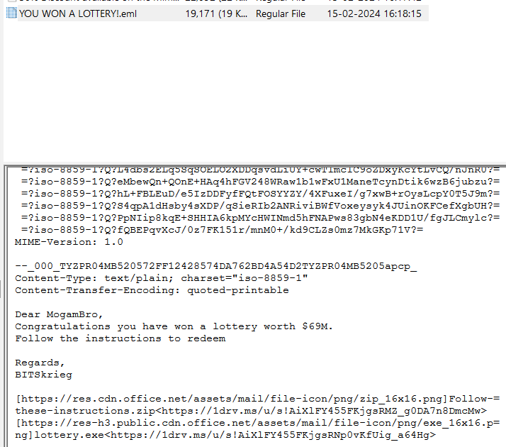
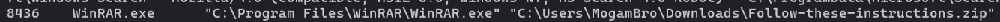
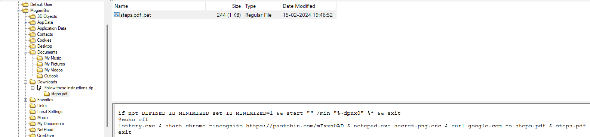
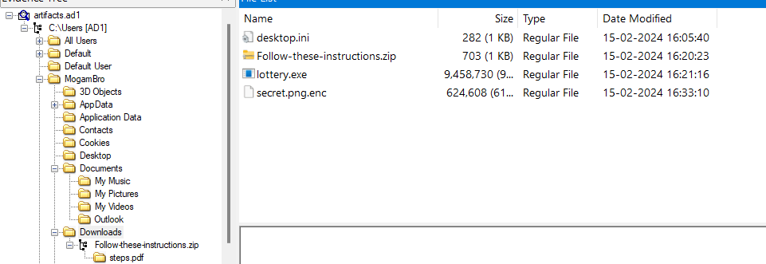
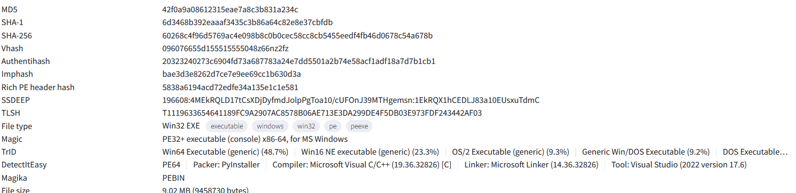
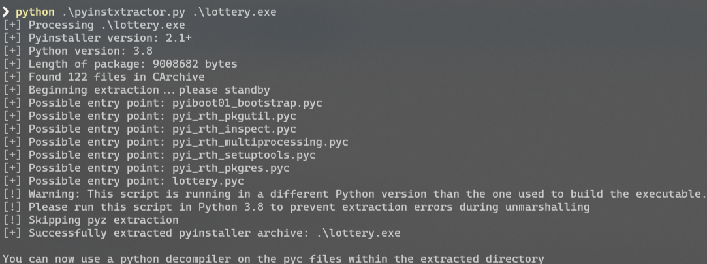
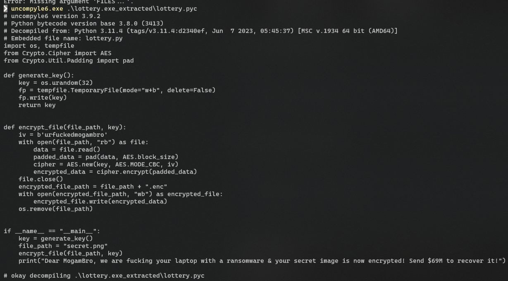
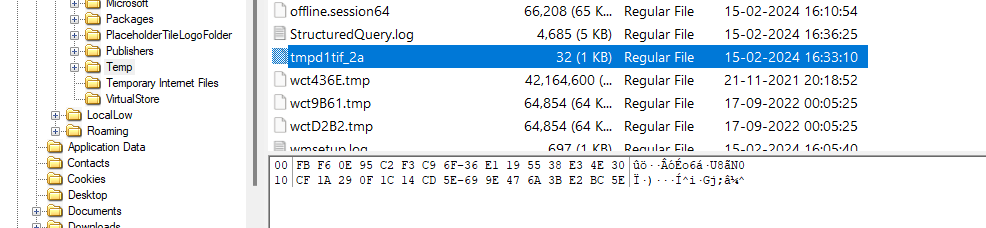
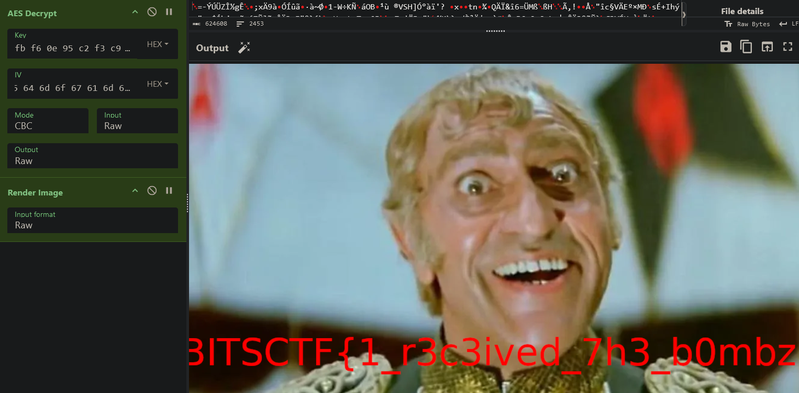

In one of the spam mails 

MogamBro downloaded a zip file

Ideally the next step someone would be to unzip the file.
I used volatility to examine the memmdump file and found this

In the downloads folder there is a zip file and inside that zip file is the payload 

This payload downloads several files

The file `lottery.exe` is mallicious

I uploaded the file on virus total and got these details 

The `detect it easy(DIE)` tool says that `pyinstaller` was used to bundle the files 

So I used a tool to de-bundle those files 
(https://github.com/extremecoders-re/pyinstxtractor/blob/master/pyinstxtractor.py)

The output says run a python decompiler on a pyc file \
A pyc file a compiled version of the python source code

I decompiled the lottery.pyc file

The temporary file that contained the key was never deleted. 

Next i used cyberchef to decrypt AES 

