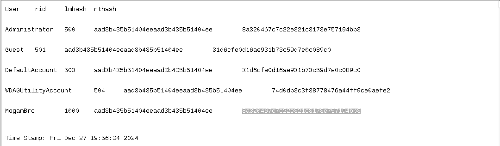
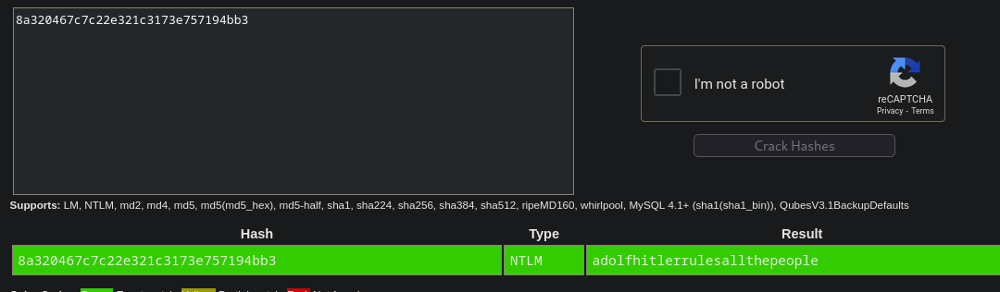

In windows, passwords are stored as hashes which we can view using volatility plugin called windows.hashdump.Hashdump

I tried both LM and NT hash on (https://crackstation.net/) and NT hash gave some meaningful string 

I suppose this is the password