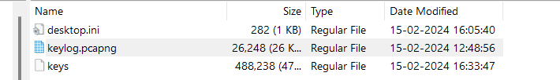

On the desktop, there is a file called `key`.

The `key` file contains the `TLS` encryption keys.

Before examining the `trace.pcap` file, we have to import this file into Wireshark. 

Go to `Edit -> Preferences -> Protocols -> TLS -> (Pre) Master Secret log filename` and add this file.

This way, it will allow Wireshark to decrypt TLS traffic.

I came across this article which helped me a lot in this challenge:
[Analyzing HTTP/2 with Wireshark](https://celaldogan2010.medium.com/analyzing-http-2-with-wireshark-64c15793e91)

So, we have to analyze files sent or received using the `HTTP/2 over TLS` protocol.

I exported the HTTP objects.

Then, I searched for the flag in all the files.

