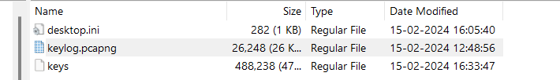
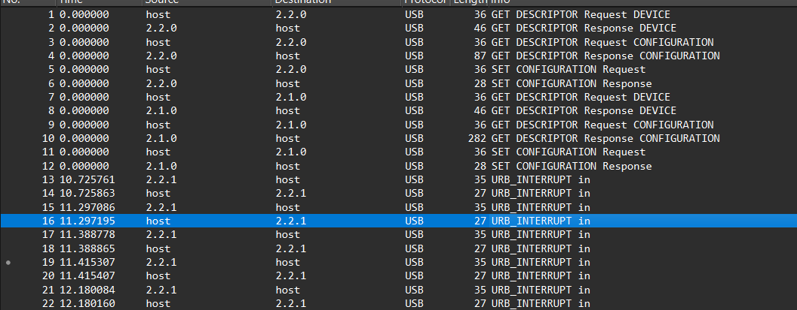

In the desktop there is a key and keylog file

A packet capture file, or PCAP file, is a data file that contains network packet data

Upon analyzing this file with wireshark it is clear that it only contains packets transfered from USB 
And since the question mentions that the keyboard was somehow involved i can safely assume that this is captured from a USB keyboard. 
There is also multiple interrupts in the log which occurs in the case of keybaords

I can use this filter 

`usb.transfer_type == 0x01 and frame.len == 35 and !(usb.capdata == 00:00:00:00:00:00:00:00)`

To capture only the keyboard interrupts

Next we just have to parse this keybaord inputs and for that we can use (https://github.com/TeamRocketIst/ctf-usb-keyboard-parser)

the flag `BITSCTF{I_7h1nk_th3y_4Re_k3yl0991ng_ME!}`

