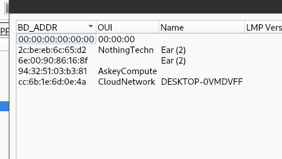
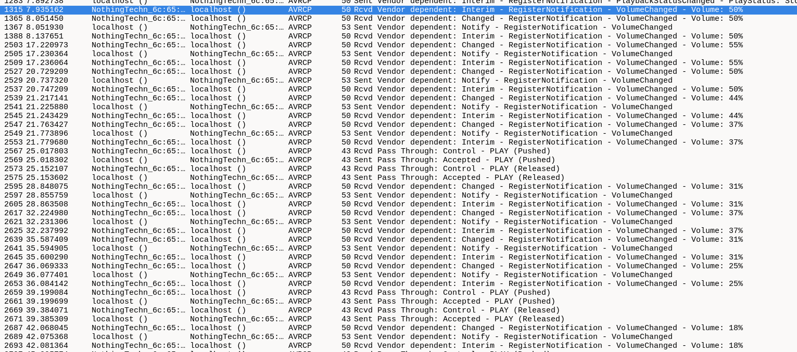

The bluetooth device used here is 

After scrolling around a bit and filtering different protocols I noticed that there were several volume ups and downs and in the question it was emphasised that Mr Jaap Harsten liked to fidget a lot

This looks like morse code

Volume up can be -\
Volume down can .
Push and release can be blank space

`-... .-.. . ..--.- ..-. -.--`

The flag is `0ctf{BLE_FY}`
