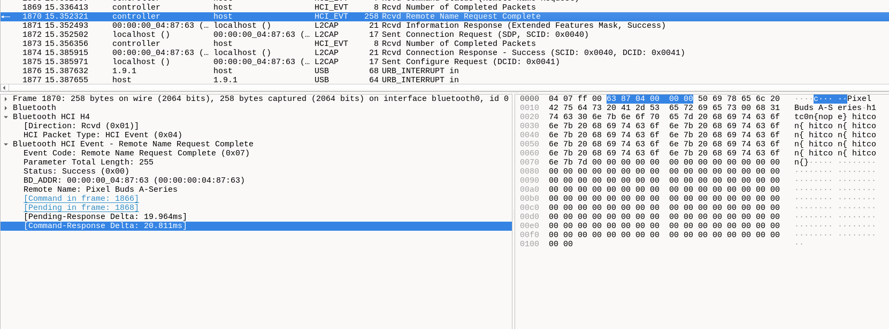
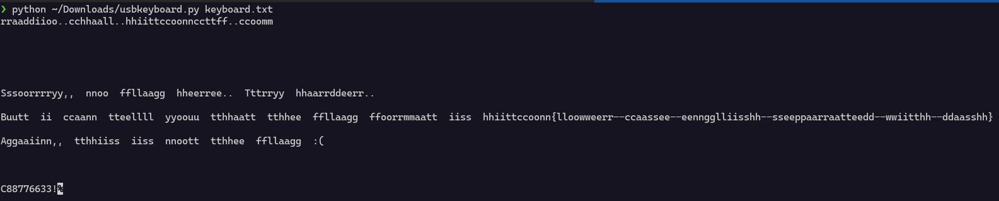

The bluetooth device used here is pixel buds A series and there are several audio files captured here

The Google Pixel Buds A-Series uses the AAC and SBC Bluetooth codecs for audio: 

AAC uses MPG-2 or MPG-4 protocol

I used this command to extract the keyboard inputs 

    tshark -r ./usb.pcap -Y 'usb.capdata && usb.data_len == 8' -T fields -e usb.capdata | sed 's/../:&/g2' | keybaord.txt

(https://github.com/TeamRocketIst/ctf-usb-keyboard-parser)
