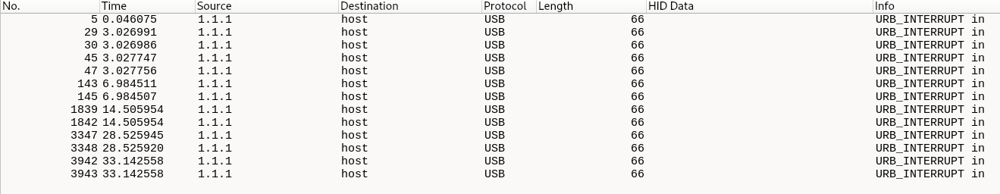
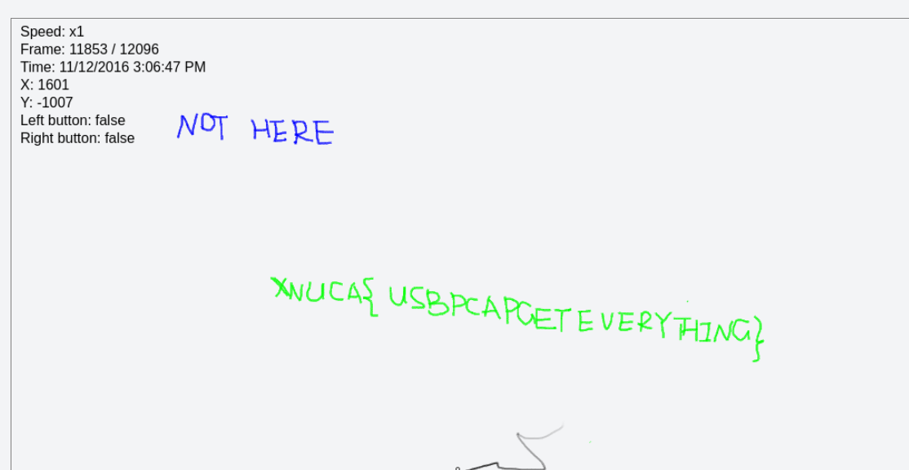

The host sends a HCI_cmd and requests for the name of the controller
The controller sends a HCI_EVT and sends its name
The bluetooth device used here is pixel buds A series
The Google Pixel Buds A-Series uses the AAC and SBC Bluetooth codecs for audio encoding 

This is the first audio that was sent. It was sent using MPEG1 encoding.

I AM CLUELESS NOW

There are several IP address that communicate via USB 
1.1.1 (Not sure what this is)

There is no HID data so it probably does not have the flag

1.10.1 (Keyboard)
I used this tool to extract and read keyboard input (https://github.com/TeamRocketIst/ctf-usb-keyboard-parser)

1.9.1 (Mouse)
Upon analyzing the mouse using https://github.com/WangYihang/USB-Mouse-Pcap-Visualizer I got this

Is this the flag? Not sure

