# Inspect Element

We can use inspect element to view the HTML of the page 

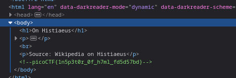

As we can see the flag is written as a comment in the page

&nbsp;

***

# Intro to Burp 

Burpsuite is a tool which we can use to intercept connection between server and client. It sits between the user's browser and the webserver and allow users to intercept, inspect, modify traffic

To start the challenge we have to starts an instance which gives a URL
The url opens up a registration page on which we can fill any random values and register which returns another page that asks for OTP
Since we dont have any OTP we need to trick server into thinking it never needed an OTP to begin with and since it is requiered to fill the OTP text field we cannot do it simply from the webpage

Now we use burpsuite to intercept data that is sent to the server

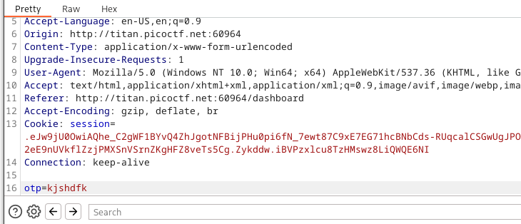

As we can see burpsuite first stops whatever data is to be sent to the server to allow us to modify it

Now we can just remove the OTP field from here

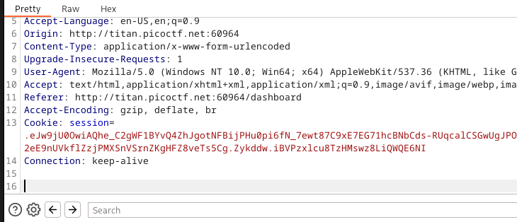

and forward the modified data which gives us the flag

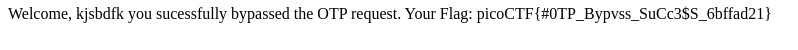

&nbsp;

***

# Dont-use-client-side

In this challenge the client side is not trusted which means it needs to verify first. 
We can look at the debugger and then index.js which contains a nested if else statement that verifies whatever is entered

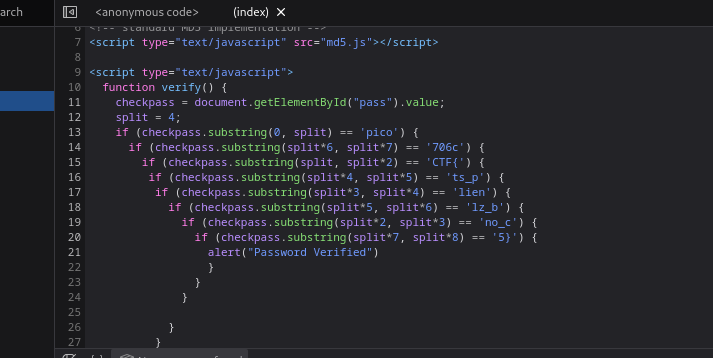

As we can see this nested if else statements verifies only of a specific string is entered and that specific string is the flag 
So based on the above checks the password should be `picoCTF{no_clients_plz_b706c5}`

We can also use burpsuite to intercept the javascript

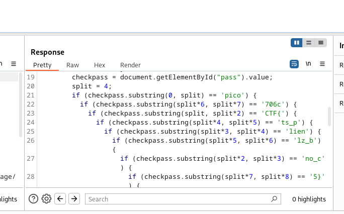

For this we have to modify the proxy settings to allow detection of javascript

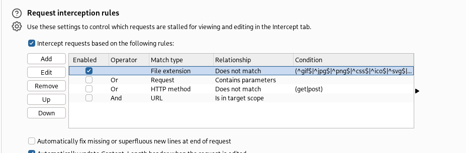

&nbsp;

***

# Where are the robots

Robots in the context of websites is `/robots.txt` \
It is a set of instructions for bots or more specifically good bots like webcrawlers(a bot that systematically browses the internet and collects information). \
It basically tells the webcrawler which parts of the site it is allowed to visit. \
It is used as a prevention measure to stop overloading. 

`robots.txt` is a normal text file that is hosted on a server. It doesnt enforce any rule so bad bots simply ignore them but webcrawlers first vists this url when it first visits a websote.

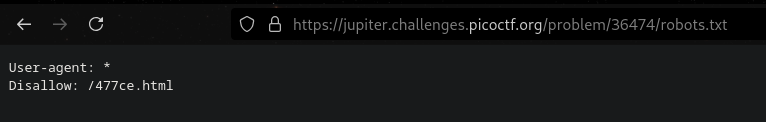

as we can see `/477ce.html` is a page that cannot be visited by webcrawlers but we can

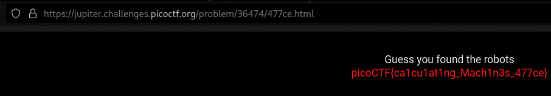

&nbsp;

***

# SQL direct

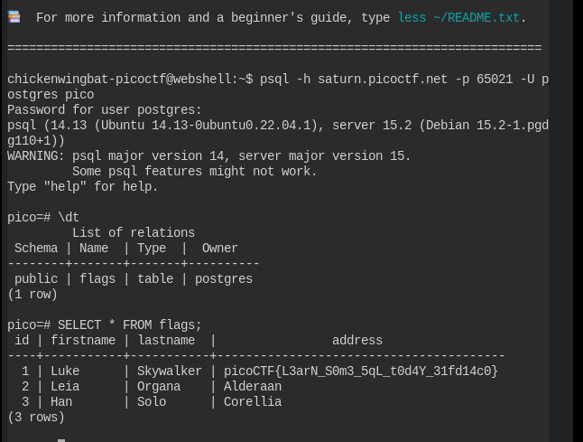

`\dt` command displays all the table in the database

`SELECT * FROM flags` displays all the columns and rows in the `flags` table

&nbsp;

***

# Power Cookies

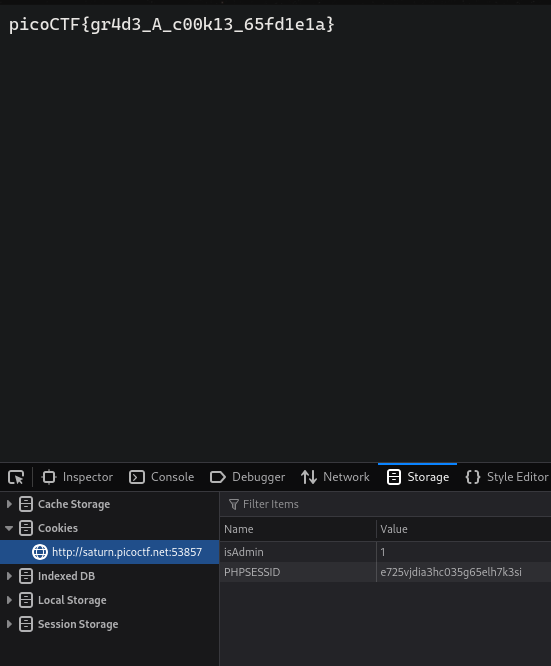

In this challenge we just had to change the `isAdmin` value from 0 to 1 in our cookies which will basically tell the server that we are an admin.
