# Inspect Element

We can use inspect element to view the HTML of the page 

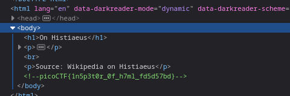

As we can see the flag is written as a comment in the page

&nbsp;

***

# Intro to Burp 

Burpsuite is a tool which we can use to intercept connection between server and client. It sits between the user's browser and the webserver and allow users to intercept, inspect, modify traffic

To start the challenge we have to starts an instance which gives a URL
The url opens up a registration page on which we can fill any random values and register which returns another page that asks for OTP
Since we dont have any OTP we need to trick server into thinking it never needed an OTP to begin with and since it is requiered to fill the OTP text field we cannot do it simply from the webpage

Now we use burpsuite to intercept data that is sent to the server

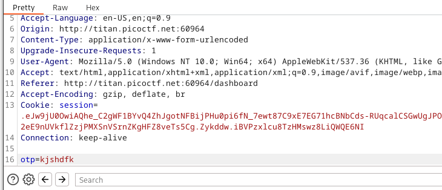

As we can see burpsuite first stops whatever data is to be sent to the server to allow us to modify it

Now we can just remove the OTP field from here

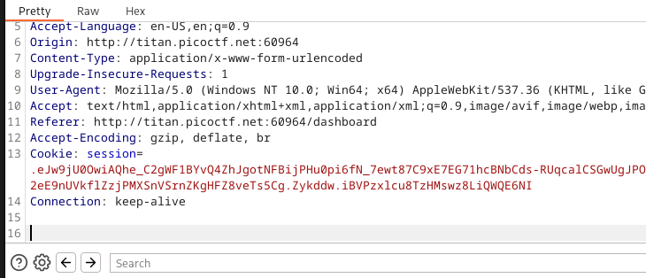

and forward the modified data which gives us the flag

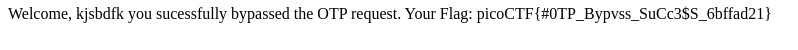


&nbsp;

***

# Dont-use-client-side

In this challenge the client side is not trusted which means it needs to verify first. 
We can look at the debugger and then index.js which contains a nested if else statement that verifies whatever is entered

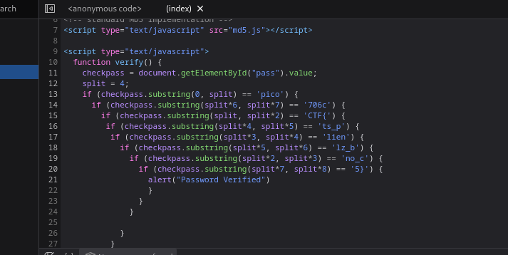

As we can see this nested if else statements verifies only of a specific string is entered and that specific string is the flag 
So based on the above checks the password should be `picoCTF{no_clients_plz_b706c5}`

We can also use burpsuite to intercept the javascript

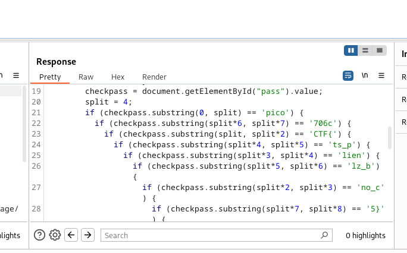

For this we have to modify the proxy settings to allow detection of javascript

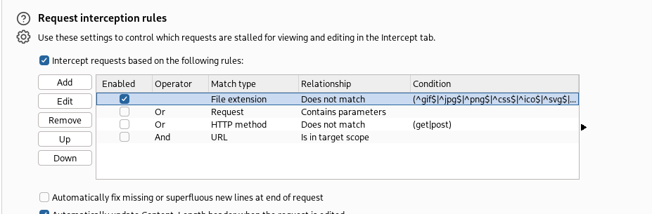


&nbsp;

***

# Where are the robots

Robots in the context of websites is `/robots.txt` \
It is a set of instructions for bots or more specifically good bots like webcrawlers(a bot that systematically browses the internet and collects information). \
It basically tells the webcrawler which parts of the site it is allowed to visit. \
It is used as a prevention measure to stop overloading. 

`robots.txt` is a normal text file that is hosted on a server. It doesnt enforce any rule so bad bots simply ignore them but webcrawlers first vists this url when it first visits a websote.

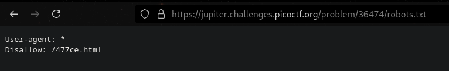

as we can see `/477ce.html` is a page that cannot be visited by webcrawlers but we can

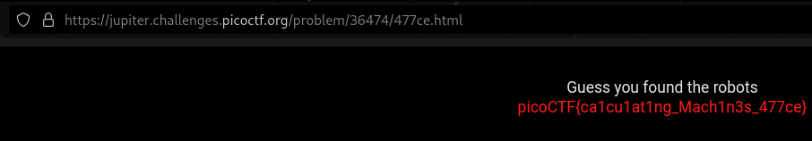

&nbsp;

***

# SQL direct

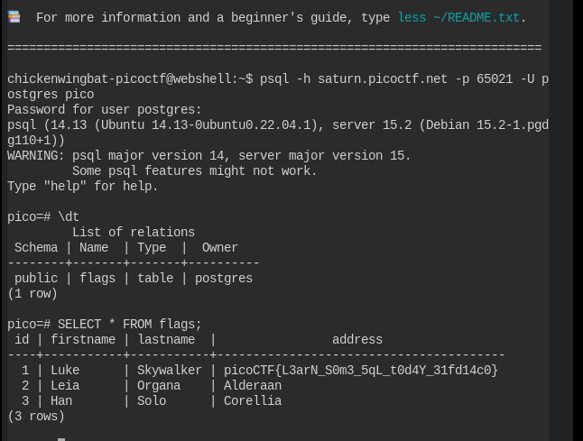

`\dt` command displays all the table in the database

`SELECT * FROM flags` displays all the columns and rows in the `flags` table

&nbsp;

***

# Power Cookies

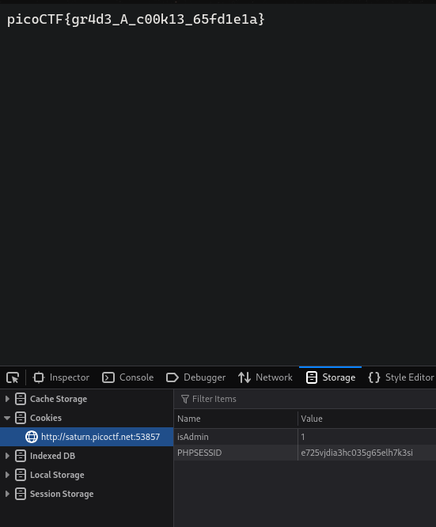

In this challenge we just had to change the `isAdmin` value from 0 to 1 in our cookies which will basically tell the server that we are an admin.

&nbsp;

***

# Who are you

### Message headers
They are a key value pairs included in the header section of a message being sent over a network protocol like HTTP or email (SMTP) etc.\
It carries the meta data about the message which provides information about the message.

There are several types of message headers such as General headers(Applies to both request and response), request headers(provides information about client's request), response headers(provides information about server's response), entity headers(contains information about the content of the message).

For this challlenge we will look into Request headers

### Request headers

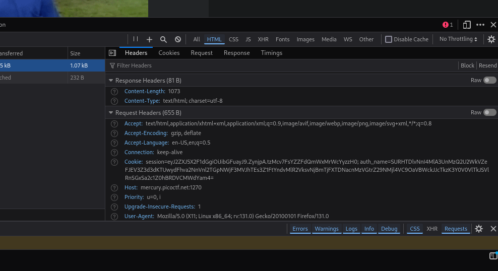

Headers can be viewed under the network tab of developer tools or we can use bursuite to view it.

&nbsp;

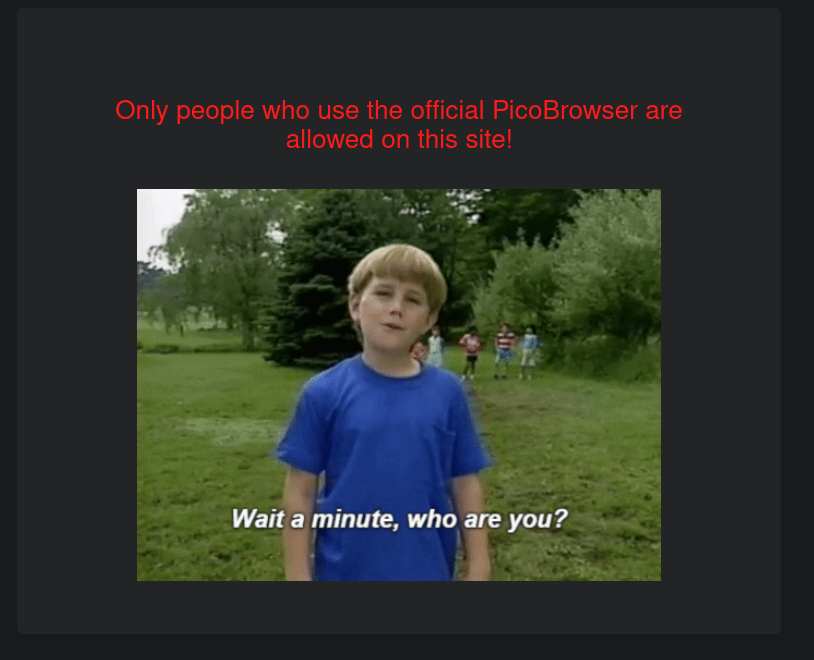

Under the headers section above there is a request headers section and under that there is a key value pair that states the browser and operating system. 

So we just have to change the value to `PicoBrowser`

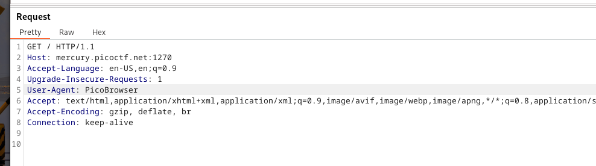

&nbsp;

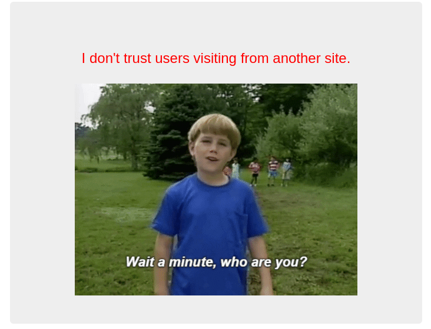

To spoof the server into thinking we were directed to this site from the correct url we can use the `Referer` header under request headers

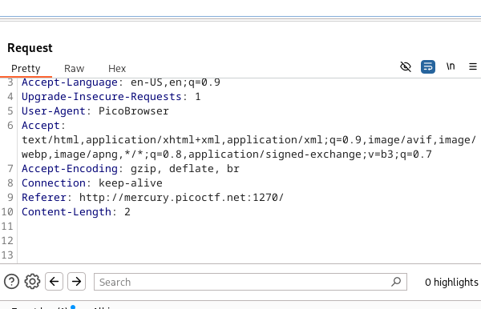

&nbsp;

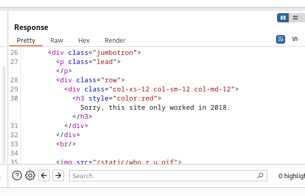

To provide the server with the Date and time at which the message was generated we can use `Date` header.

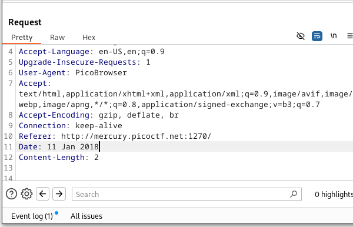

&nbsp;

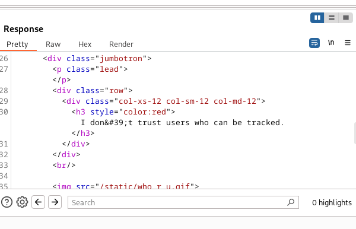

`DNT` can be used to signal that we dont want to be tracked by websites and third parties.

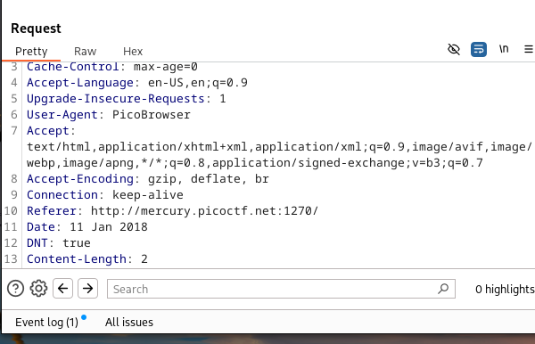

&nbsp;

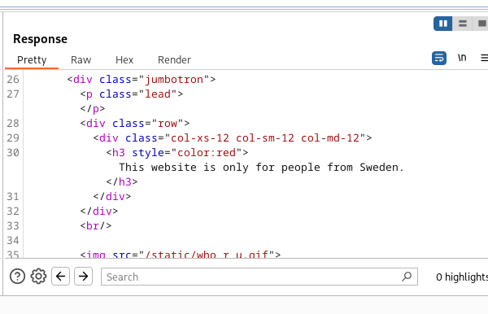

To specify the IP address we can use `X-Forwaded-For`. 
This header is a custom header i.e it is not included in the IETF RFC standard.
It was introduced by various proxy vendors to realy client's original IP address. 
Since this is an unofficial header, hence it has X at the begining

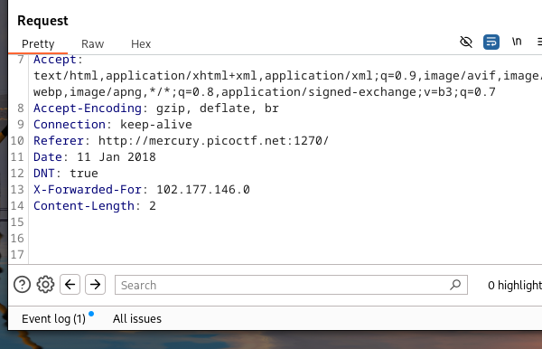

&nbsp;

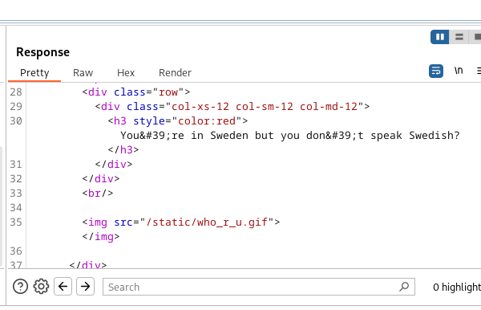

To specify the language we can use the `Accept-Language` header

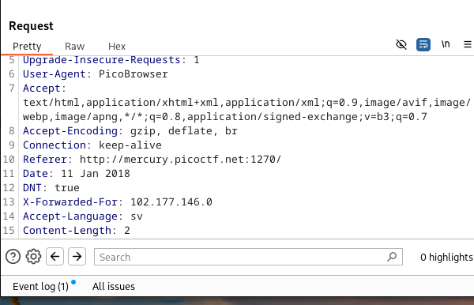

&nbsp;

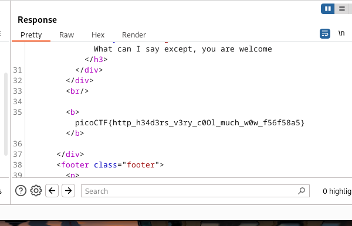

&nbsp;

***

# SOAP

XXE is XML external entity injection.
It allows attackers to interfere with an application's normal processing of XML data.
This attack occurs when XML input containing a reference to an external entity is processed by a weakly configured XML parser. 

In this challenge we have to exploit XXE to retreive files in `etc/passwd/` on the server. 

&nbsp;

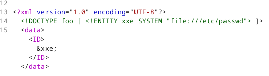

```XML
    <?xml version="1.0" encoding="UTF-8"?>
    <!DOCTYPE foo [ <!ENTITY xxe SYSTEM "file:///etc/passwd"> ]>
```

This was added in transit. 
This defines an entity named `xxe` that tries to read the `/etc/passwd/` file on a Unix-like system

Now when the XML parser on the server reads `&xxe;`, it will attempt to fetch the contents of the `/etc/passwd/`. 

And the output will be 

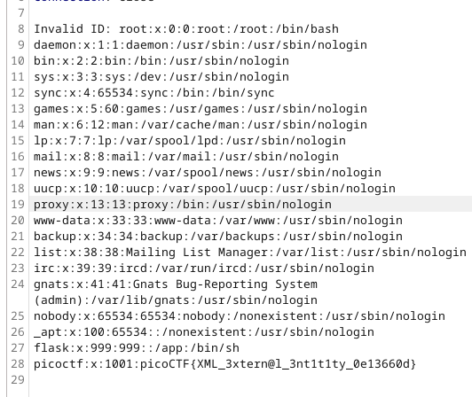

As we can see this is typically what is stored inside `/etc/pssawd/` in a Unix-like system

&nbsp;

***

# More SQLi

SQL injection is a way attackers can use to inject mallicious sql querrys in between. \
If a SQL querry uses user input then the user can write the input such a way that will allow them to insert their own SQL querry within that user input. \
The server will execute the querry normally and it will also execute the attackers malicious querry.


    SQL query: SELECT id FROM users WHERE password = 'ajksbd' AND username = 'kajsdb'

In this challenge this is the SQL querry that executed at ther server side \
The password and username is entered by user without the inverted commas \
SQL detects a string input by putting it inside inverted comma \
So if we were to add an inverted comma at the beginning which will allow us to add our own querry after it and end that querry with `--` which is basically a start of a comment

    SELECT id FROM users WHERE password = ' ' OR 1=1 --' AND username = 'kajsdb'

The password ` ' OR 1=1 --` is added by us. \
The inverted comma at the begining and the inverted comma inserted by SQL will form one string which will act as an input to `password` \
Since password is not equal to that, it will result in false. \
But the presence of `OR 1=1` will result in `true` and `--` will comment out anything after it \
So overall the `WHERE` clause will result in true and we will pass the login page. 

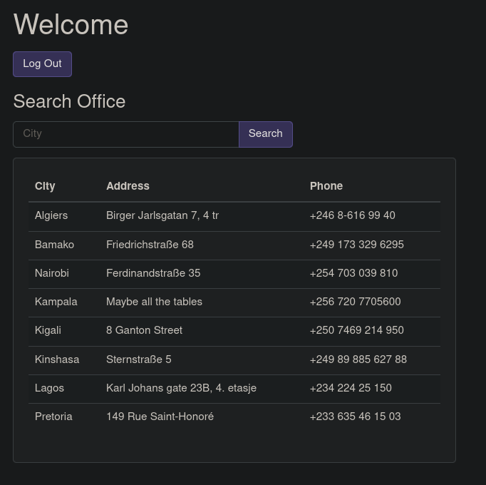

Now we can enter ` ' UNION SELECT name, sql, null FROM sqlite_master; --`

This querry will give us the name of all the tables and commands used to create the flag. \
Among these tables we can see that there is a table that contains a column called `flag` 

Now we just have to retreive it using ` ' UNION SELECT flag, null, null FROM more_tables;--`

&nbsp;

***

# Some assembly required

Web assembly is a low level assembly like language that can run on browsers at native speed. \
Other languages can be compiled to web assembly. \
Web assembly modules can be loaded into javascript and share functionality between the two.

In the challenge we can see that a web assembly module was loaded and at the end of the file we find out flag.

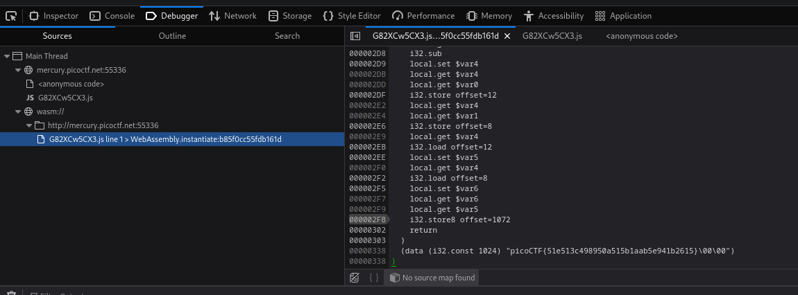

&nbsp;

***

# Most cookies

